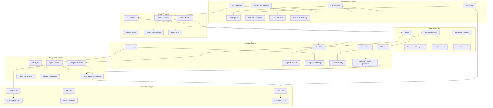

# Architecture Overview

Wombat is a high-performance LSM-Tree (Log-Structured Merge-Tree) key-value database implemented in Zig. This document provides a comprehensive overview of the system architecture and component interactions.

## System Architecture

## Core Components

### 1. Client API Layer
- **DB Interface**: Primary database operations (get, set, delete)
- **Options**: Configuration management and validation
- **Error Handling**: Comprehensive error reporting and context

### 2. Transaction System
- **Oracle**: Timestamp-based transaction ordering
- **Conflict Detection**: Read-write and write-write conflict resolution
- **MVCC**: Multi-version concurrency control

### 3. Storage Engine

#### MemTable (In-Memory)
- **Implementation**: Skip list data structure
- **Purpose**: Fast in-memory writes with sorted iteration
- **Size**: Configurable (default 64MB)
- **Flushing**: Automatic flush to L0 when full

#### Value Log (VLog)
- **Purpose**: Separate storage for large values
- **Format**: Append-only log with space reclaim
- **Benefits**: Reduces write amplification for large values
- **Space Reclaim**: Background process for space reclamation

#### SSTable Hierarchy (L0-L6)
- **L0**: Unsorted files from MemTable flushes
- **L1-L6**: Sorted, non-overlapping files
- **Compaction**: Background merge process
- **Indexing**: Bloom filters and binary search indices

### 4. Background Services

#### Compaction Worker
- **Strategies**: Level-based, size-tiered, universal
- **Scheduling**: Priority-based job scheduling
- **Throttling**: I/O throttling to prevent performance impact
- **Monitoring**: Compaction statistics and metrics

#### Write-Ahead Log (WAL)
- **Durability**: Ensures data persistence before MemTable writes
- **Recovery**: Crash recovery mechanism
- **Sync**: Configurable sync policies

## Data Flow

### Write Path
1. **WAL Write**: Data written to WAL for durability
2. **MemTable Insert**: Data inserted into in-memory SkipList
3. **Size Check**: Monitor MemTable size
4. **Flush**: When full, flush MemTable to L0 SSTable
5. **Compaction**: Background compaction merges SSTables

### Read Path
1. **MemTable Lookup**: Check current MemTable
2. **L0 Search**: Search L0 SSTables (newest first)
3. **Level Search**: Binary search through L1-L6
4. **Value Retrieval**: Fetch from VLog if value pointer
5. **Result Assembly**: Combine key-value result

### Compaction Process
1. **Job Selection**: Priority-based compaction job selection
2. **Input Files**: Select overlapping SSTables
3. **Merge**: Merge-sort with deduplication
4. **Output**: Write new SSTables to target level
5. **Cleanup**: Remove old SSTables atomically

## Memory Management

### Arena Allocator
- **Purpose**: Efficient memory allocation for data structures
- **Benefits**: Reduces fragmentation and allocation overhead
- **Usage**: SkipList nodes, temporary buffers

### Memory Hierarchy
- **L1 Cache**: MemTable (hot data)
- **L2 Cache**: Block cache (SSTable blocks)
- **L3 Storage**: SSTables on disk
- **L4 Storage**: Value log files

## Concurrency Model

### Read-Write Separation
- **Reads**: Lock-free SkipList traversal
- **Writes**: Single-writer to MemTable
- **Compaction**: Background threads with minimal blocking

### Synchronization
- **Atomic Operations**: Timestamp generation and counters
- **Channels**: Work distribution to background threads
- **Mutexes**: Minimal use for critical sections

## Persistence and Recovery

### Crash Recovery
1. **WAL Replay**: Replay unsynced WAL entries
2. **MemTable Rebuild**: Reconstruct MemTable from WAL
3. **Manifest Recovery**: Restore SSTable metadata
4. **Consistency Check**: Verify data integrity

### Checkpointing
- **Periodic**: Regular WAL truncation
- **Compaction**: Metadata updates after compaction
- **Shutdown**: Clean shutdown with full sync

## Performance Characteristics

### Write Performance
- **Sequential Writes**: Optimized for append-only patterns
- **Write Amplification**: Minimized through value log separation
- **Batching**: Efficient batch write operations

### Read Performance
- **Bloom Filters**: Reduce disk I/O for negative lookups
- **Block Cache**: Cache frequently accessed SSTable blocks
- **Index Efficiency**: Binary search within SSTables

### Space Efficiency
- **Compression**: Configurable compression algorithms
- **Space Reclaimer**: Automated space reclamation
- **Compaction**: Background merge reduces space amplification

## Configuration Points

### Performance Tuning
- **MemTable Size**: Trade-off between memory usage and flush frequency
- **Compaction Parallelism**: Number of background compaction threads
- **Cache Sizes**: Block cache and table cache sizing

### Durability Settings
- **WAL Sync**: Sync frequency for durability guarantees
- **Compaction Throttling**: I/O rate limiting
- **Checkpoint Intervals**: Recovery time trade-offs

## Monitoring and Observability

### Metrics
- **Operation Counters**: Get, set, delete operation counts
- **Performance Metrics**: Latency percentiles and throughput
- **Resource Usage**: Memory, disk, CPU utilization
- **Compaction Stats**: Compaction rates and efficiency

### Error Tracking
- **Error Rates**: Categorized error frequency
- **Recovery Events**: Crash recovery statistics
- **Performance Regressions**: Automated performance monitoring

This architecture provides a solid foundation for a high-performance, durable key-value store with strong consistency guarantees and efficient resource utilization.
