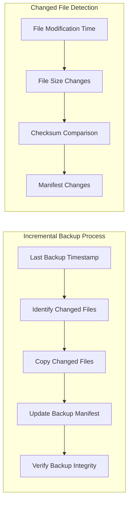
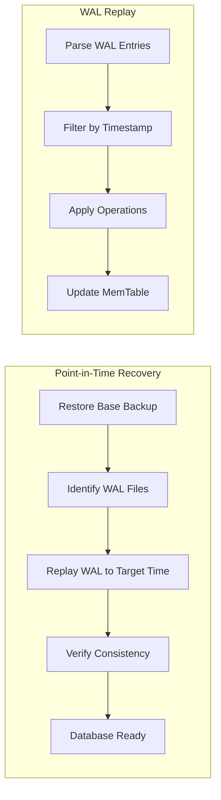
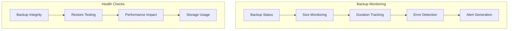
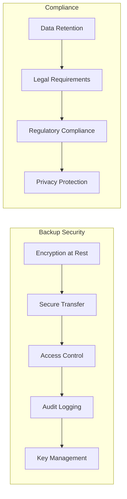

# Backup and Restore

This document covers backup and restore procedures for Wombat database, including data protection strategies and recovery procedures.

## Backup Overview

```mermaid
graph TB
    subgraph "Backup Components"
        A[SSTable Files] --> B[Manifest Files]
        B --> C[WAL Files]
        C --> D[Value Log Files]
        D --> E[Configuration Files]
    end
    
    subgraph "Backup Types"
        F[Full Backup] --> G[Incremental Backup]
        G --> H[Continuous Backup]
        H --> I[Point-in-Time Recovery]
    end
    
    subgraph "Storage Options"
        J[Local Storage] --> K[Network Storage]
        K --> L[Cloud Storage]
        L --> M[Distributed Storage]
    end
```



## Backup Strategy

### Full Backup

A full backup captures the complete database state at a specific point in time.

```bash
# Create full backup
mkdir -p /backup/$(date +%Y%m%d_%H%M%S)
cp -r /path/to/database/* /backup/$(date +%Y%m%d_%H%M%S)/

# Backup with compression
tar -czf /backup/wombat_backup_$(date +%Y%m%d_%H%M%S).tar.gz /path/to/database/

# Backup with verification
rsync -avz --checksum /path/to/database/ /backup/$(date +%Y%m%d_%H%M%S)/
```

### Incremental Backup

Incremental backups only capture changes since the last backup.



### Backup Implementation

```zig
pub const BackupManager = struct {
    db_path: []const u8,
    backup_path: []const u8,
    allocator: std.mem.Allocator,
    
    pub const BackupType = enum {
        full,
        incremental,
        continuous,
    };
    
    pub const BackupConfig = struct {
        compression: bool = true,
        verify_integrity: bool = true,
        exclude_wal: bool = false,
        exclude_temp_files: bool = true,
        max_backup_size: ?u64 = null,
        retention_days: u32 = 30,
    };
    
    pub fn createBackup(self: *BackupManager, backup_type: BackupType, config: BackupConfig) !void {
        const timestamp = std.time.timestamp();
        const backup_dir = try std.fmt.allocPrint(self.allocator, "{s}/backup_{}", .{self.backup_path, timestamp});
        defer self.allocator.free(backup_dir);
        
        // Create backup directory
        try std.fs.cwd().makeDir(backup_dir);
        
        switch (backup_type) {
            .full => try self.createFullBackup(backup_dir, config),
            .incremental => try self.createIncrementalBackup(backup_dir, config),
            .continuous => try self.createContinuousBackup(backup_dir, config),
        }
        
        // Create backup manifest
        try self.createBackupManifest(backup_dir, backup_type, config);
        
        // Verify backup if requested
        if (config.verify_integrity) {
            try self.verifyBackup(backup_dir);
        }
        
        // Clean up old backups
        try self.cleanupOldBackups(config.retention_days);
    }
    
    fn createFullBackup(self: *BackupManager, backup_dir: []const u8, config: BackupConfig) !void {
        const db_dir = try std.fs.cwd().openDir(self.db_path, .{});
        defer db_dir.close();
        
        const backup_dir_handle = try std.fs.cwd().openDir(backup_dir, .{});
        defer backup_dir_handle.close();
        
        // Copy all database files
        var iterator = db_dir.iterate();
        while (try iterator.next()) |entry| {
            if (entry.kind == .file) {
                // Skip temporary files if configured
                if (config.exclude_temp_files and std.mem.endsWith(u8, entry.name, ".tmp")) {
                    continue;
                }
                
                // Skip WAL files if configured
                if (config.exclude_wal and std.mem.endsWith(u8, entry.name, ".wal")) {
                    continue;
                }
                
                try self.copyFile(db_dir, backup_dir_handle, entry.name, config.compression);
            }
        }
    }
    
    fn copyFile(self: *BackupManager, src_dir: std.fs.Dir, dst_dir: std.fs.Dir, filename: []const u8, compress: bool) !void {
        const src_file = try src_dir.openFile(filename, .{});
        defer src_file.close();
        
        const dst_filename = if (compress) try std.fmt.allocPrint(self.allocator, "{s}.gz", .{filename}) else filename;
        defer if (compress) self.allocator.free(dst_filename);
        
        const dst_file = try dst_dir.createFile(dst_filename, .{});
        defer dst_file.close();
        
        if (compress) {
            try self.compressFile(src_file, dst_file);
        } else {
            try self.copyFileContents(src_file, dst_file);
        }
    }
    
    fn compressFile(self: *BackupManager, src: std.fs.File, dst: std.fs.File) !void {
        var buffer: [8192]u8 = undefined;
        var compressor = std.compress.gzip.compressor(dst.writer());
        
        while (true) {
            const bytes_read = try src.read(&buffer);
            if (bytes_read == 0) break;
            
            try compressor.writer().writeAll(buffer[0..bytes_read]);
        }
        
        try compressor.finish();
    }
};
```

## Restore Procedures

### Restore Process


### Restore Implementation

```zig
pub const RestoreManager = struct {
    backup_path: []const u8,
    restore_path: []const u8,
    allocator: std.mem.Allocator,
    
    pub const RestoreConfig = struct {
        verify_before_restore: bool = true,
        verify_after_restore: bool = true,
        force_restore: bool = false,
        point_in_time: ?i64 = null,
    };
    
    pub fn restoreBackup(self: *RestoreManager, backup_name: []const u8, config: RestoreConfig) !void {
        const backup_dir = try std.fmt.allocPrint(self.allocator, "{s}/{s}", .{self.backup_path, backup_name});
        defer self.allocator.free(backup_dir);
        
        // Verify backup integrity
        if (config.verify_before_restore) {
            try self.verifyBackup(backup_dir);
        }
        
        // Check if target directory exists
        if (!config.force_restore) {
            if (std.fs.cwd().openDir(self.restore_path, .{})) |dir| {
                dir.close();
                return error.RestoreDirectoryExists;
            } else |_| {}
        }
        
        // Create restore directory
        try std.fs.cwd().makeDir(self.restore_path);
        
        // Restore files
        try self.restoreFiles(backup_dir);
        
        // Verify restored data
        if (config.verify_after_restore) {
            try self.verifyRestored();
        }
    }
    
    fn restoreFiles(self: *RestoreManager, backup_dir: []const u8) !void {
        const backup_dir_handle = try std.fs.cwd().openDir(backup_dir, .{});
        defer backup_dir_handle.close();
        
        const restore_dir_handle = try std.fs.cwd().openDir(self.restore_path, .{});
        defer restore_dir_handle.close();
        
        var iterator = backup_dir_handle.iterate();
        while (try iterator.next()) |entry| {
            if (entry.kind == .file and !std.mem.eql(u8, entry.name, "backup_manifest.json")) {
                if (std.mem.endsWith(u8, entry.name, ".gz")) {
                    // Decompress file
                    const original_name = entry.name[0..entry.name.len - 3]; // Remove .gz
                    try self.decompressFile(backup_dir_handle, restore_dir_handle, entry.name, original_name);
                } else {
                    // Copy file directly
                    try self.copyFileContents(backup_dir_handle, restore_dir_handle, entry.name);
                }
            }
        }
    }
    
    fn decompressFile(self: *RestoreManager, src_dir: std.fs.Dir, dst_dir: std.fs.Dir, src_name: []const u8, dst_name: []const u8) !void {
        const src_file = try src_dir.openFile(src_name, .{});
        defer src_file.close();
        
        const dst_file = try dst_dir.createFile(dst_name, .{});
        defer dst_file.close();
        
        var decompressor = std.compress.gzip.decompressor(src_file.reader());
        var buffer: [8192]u8 = undefined;
        
        while (true) {
            const bytes_read = try decompressor.reader().read(&buffer);
            if (bytes_read == 0) break;
            
            try dst_file.writeAll(buffer[0..bytes_read]);
        }
    }
};
```

## Point-in-Time Recovery

### WAL-based Recovery



### Recovery Implementation

```zig
pub const PointInTimeRecovery = struct {
    db: *DB,
    target_timestamp: i64,
    
    pub fn recover(self: *PointInTimeRecovery) !void {
        // Step 1: Restore base backup
        try self.restoreBaseBackup();
        
        // Step 2: Replay WAL files up to target timestamp
        try self.replayWALToTimestamp();
        
        // Step 3: Verify database consistency
        try self.verifyConsistency();
    }
    
    fn replayWALToTimestamp(self: *PointInTimeRecovery) !void {
        const wal_dir = try std.fs.cwd().openDir(".", .{});
        defer wal_dir.close();
        
        // Find all WAL files
        var wal_files = std.ArrayList([]const u8).init(self.db.allocator);
        defer wal_files.deinit();
        
        var iterator = wal_dir.iterate();
        while (try iterator.next()) |entry| {
            if (entry.kind == .file and std.mem.endsWith(u8, entry.name, ".wal")) {
                try wal_files.append(try self.db.allocator.dupe(u8, entry.name));
            }
        }
        
        // Sort WAL files by timestamp
        std.sort.sort([]const u8, wal_files.items, {}, compareWALFiles);
        
        // Replay each WAL file
        for (wal_files.items) |wal_file| {
            try self.replayWALFile(wal_file);
        }
    }
    
    fn replayWALFile(self: *PointInTimeRecovery, wal_filename: []const u8) !void {
        const wal_file = try std.fs.cwd().openFile(wal_filename, .{});
        defer wal_file.close();
        
        var reader = wal_file.reader();
        
        while (true) {
            const entry = WALEntry.read(reader) catch |err| {
                if (err == error.EndOfStream) break;
                return err;
            };
            
            // Stop if we've reached the target timestamp
            if (entry.timestamp > self.target_timestamp) {
                break;
            }
            
            // Apply the operation
            try self.applyWALEntry(entry);
        }
    }
    
    fn applyWALEntry(self: *PointInTimeRecovery, entry: WALEntry) !void {
        switch (entry.operation) {
            .set => {
                try self.db.setInternal(entry.key, entry.value, entry.timestamp);
            },
            .delete => {
                try self.db.deleteInternal(entry.key, entry.timestamp);
            },
        }
    }
};
```

## Backup Automation

### Scheduled Backups

```bash
#!/bin/bash
# Backup script for Wombat database

DB_PATH="/var/lib/wombat"
BACKUP_PATH="/backup/wombat"
RETENTION_DAYS=30

# Create timestamp
TIMESTAMP=$(date +%Y%m%d_%H%M%S)
BACKUP_DIR="$BACKUP_PATH/backup_$TIMESTAMP"

# Create backup directory
mkdir -p "$BACKUP_DIR"

# Full backup on Sundays, incremental on other days
if [ $(date +%u) -eq 7 ]; then
    # Full backup
    echo "Creating full backup..."
    tar -czf "$BACKUP_DIR/wombat_full_$TIMESTAMP.tar.gz" -C "$DB_PATH" .
else
    # Incremental backup
    echo "Creating incremental backup..."
    find "$DB_PATH" -type f -newer "$BACKUP_PATH/last_backup" -exec cp {} "$BACKUP_DIR" \;
fi

# Update last backup timestamp
touch "$BACKUP_PATH/last_backup"

# Cleanup old backups
find "$BACKUP_PATH" -type d -name "backup_*" -mtime +$RETENTION_DAYS -exec rm -rf {} \;

echo "Backup completed: $BACKUP_DIR"
```

### Cron Configuration

```bash
# Add to crontab (crontab -e)

# Daily backup at 2 AM
0 2 * * * /usr/local/bin/wombat-backup.sh

# Weekly full backup on Sunday at 1 AM
0 1 * * 0 /usr/local/bin/wombat-full-backup.sh

# Monthly cleanup of old backups
0 3 1 * * /usr/local/bin/wombat-cleanup.sh
```

## Monitoring and Alerting

### Backup Monitoring



### Monitoring Implementation

```zig
pub const BackupMonitor = struct {
    pub const BackupStatus = struct {
        last_backup_time: i64,
        last_backup_size: u64,
        last_backup_duration: u64,
        success_rate: f64,
        errors: []const u8,
    };
    
    pub fn getBackupStatus(self: *BackupMonitor) BackupStatus {
        // Implementation to gather backup statistics
        return BackupStatus{
            .last_backup_time = self.getLastBackupTime(),
            .last_backup_size = self.getLastBackupSize(),
            .last_backup_duration = self.getLastBackupDuration(),
            .success_rate = self.calculateSuccessRate(),
            .errors = self.getRecentErrors(),
        };
    }
    
    pub fn checkBackupHealth(self: *BackupMonitor) !void {
        const status = self.getBackupStatus();
        
        // Check if backup is overdue
        const now = std.time.timestamp();
        if (now - status.last_backup_time > 24 * 60 * 60) { // 24 hours
            try self.sendAlert("Backup overdue");
        }
        
        // Check success rate
        if (status.success_rate < 0.95) {
            try self.sendAlert("Low backup success rate");
        }
        
        // Check backup size changes
        if (status.last_backup_size == 0) {
            try self.sendAlert("Empty backup detected");
        }
    }
};
```

## Best Practices

### Backup Strategy

1. **3-2-1 Rule**: 3 copies of data, 2 different media types, 1 offsite
2. **Regular Testing**: Test restore procedures regularly
3. **Automation**: Automate backup and verification processes
4. **Monitoring**: Monitor backup health and performance
5. **Documentation**: Document backup and restore procedures

### Security Considerations



This comprehensive backup and restore system ensures data protection and recovery capabilities for Wombat database deployments.