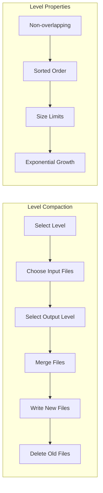
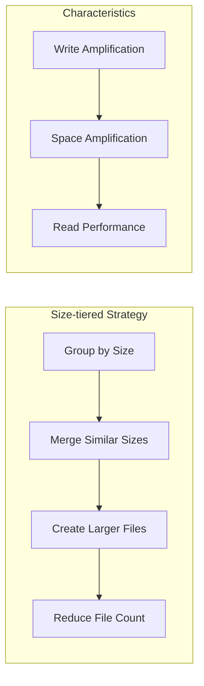
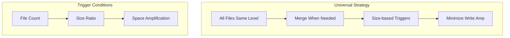
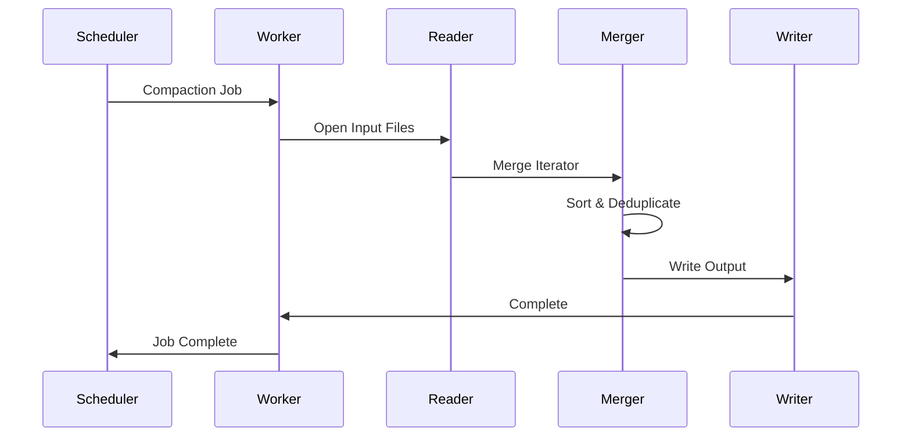
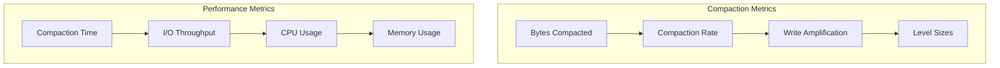
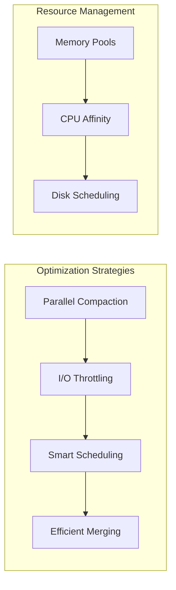

# Compaction

Compaction is a critical background process in Wombat that maintains optimal read performance by merging and reorganizing SSTables. This document covers compaction strategies, implementation details, and performance tuning.

## Compaction Overview


## Compaction Strategies

### Level-based Compaction



### Size-tiered Compaction



### Universal Compaction



## Compaction Implementation

### Compaction Picker

```zig
pub const CompactionPicker = struct {
    strategy: CompactionStrategy,
    manifest: *Manifest,
    options: *Options,
    
    pub const CompactionJob = struct {
        level: u32,
        input_files: []FileMeta,
        output_level: u32,
        estimated_size: u64,
        priority: f64,
        
        pub fn estimateWork(self: CompactionJob) u64 {
            var total_size: u64 = 0;
            for (self.input_files) |file| {
                total_size += file.size;
            }
            return total_size;
        }
    };
    
    pub fn pickCompaction(self: *CompactionPicker) ?CompactionJob {
        return switch (self.strategy) {
            .level => self.pickLevelCompaction(),
            .size_tiered => self.pickSizeTieredCompaction(),
            .universal => self.pickUniversalCompaction(),
        };
    }
    
    fn pickLevelCompaction(self: *CompactionPicker) ?CompactionJob {
        var best_score: f64 = 0;
        var best_level: u32 = 0;
        
        // Calculate scores for each level
        for (0..self.options.max_levels) |level| {
            const score = self.calculateLevelScore(@intCast(level));
            if (score > best_score and score > 1.0) {
                best_score = score;
                best_level = @intCast(level);
            }
        }
        
        if (best_score <= 1.0) return null;
        
        return self.createLevelCompactionJob(best_level, best_score);
    }
    
    fn calculateLevelScore(self: *CompactionPicker, level: u32) f64 {
        const files = self.manifest.getFilesAtLevel(level);
        if (files.len == 0) return 0;
        
        if (level == 0) {
            // L0 is scored by file count
            return @as(f64, @floatFromInt(files.len)) / 
                   @as(f64, @floatFromInt(self.options.num_level_zero_tables));
        } else {
            // Other levels scored by total size
            var total_size: u64 = 0;
            for (files) |file| {
                total_size += file.size;
            }
            
            const target_size = self.options.tableSizeForLevel(level);
            return @as(f64, @floatFromInt(total_size)) / 
                   @as(f64, @floatFromInt(target_size));
        }
    }
};
```

### Compaction Worker



### Compaction Execution

```zig
pub const CompactionWorker = struct {
    const MergeIterator = struct {
        iterators: []SSTableIterator,
        heap: std.PriorityQueue(IteratorEntry, void, compareEntries),
        
        pub fn next(self: *MergeIterator) ?KeyValue {
            while (self.heap.count() > 0) {
                const entry = self.heap.remove();
                const kv = entry.iterator.current();
                
                // Advance iterator and re-add to heap if not done
                if (entry.iterator.next()) |next_kv| {
                    self.heap.add(IteratorEntry{
                        .iterator = entry.iterator,
                        .key = next_kv.key,
                    }) catch {}; // Handle error appropriately
                }
                
                // Skip deleted entries and duplicates
                if (kv.meta & VALUE_DELETE != 0) continue;
                if (self.isDuplicate(kv.key)) continue;
                
                return kv;
            }
            return null;
        }
        
        fn isDuplicate(self: *MergeIterator, key: []const u8) bool {
            // Check if we've seen this key already in this iteration
            // Implementation depends on deduplication strategy
            return false;
        }
    };
    
    pub fn executeCompaction(self: *CompactionWorker, job: CompactionJob) !void {
        std.log.info("Starting compaction: L{} -> L{}, {} files", 
                     .{job.level, job.output_level, job.input_files.len});
        
        // Open input files
        var input_iterators = try self.openInputFiles(job.input_files);
        defer self.closeInputFiles(input_iterators);
        
        // Create merge iterator
        var merger = try MergeIterator.init(self.allocator, input_iterators);
        defer merger.deinit();
        
        // Create output writer
        var output_writer = try self.createOutputWriter(job.output_level);
        defer output_writer.close();
        
        // Merge and write
        var entries_written: u64 = 0;
        while (merger.next()) |kv| {
            try output_writer.add(kv);
            entries_written += 1;
        }
        
        // Finalize output files
        const output_files = try output_writer.finalize();
        
        // Update manifest
        try self.updateManifest(job, output_files);
        
        std.log.info("Compaction completed: {} entries written, {} output files", 
                     .{entries_written, output_files.len});
    }
    
    fn updateManifest(self: *CompactionWorker, job: CompactionJob, output_files: []FileMeta) !void {
        var edit = EditRecord.init(self.allocator);
        defer edit.deinit();
        
        // Add new files
        for (output_files) |file| {
            try edit.addFile(file);
        }
        
        // Remove old files
        for (job.input_files) |file| {
            try edit.deleteFile(file.number);
        }
        
        // Apply edit to manifest
        try self.manifest.applyEdit(edit);
    }
};
```

## Space Reclaim Integration

### Value Log Compaction


### Coordinated Compaction

```zig
pub const CoordinatedCompaction = struct {
    pub fn runSpaceReclaim(self: *CoordinatedCompaction) !void {
        // Phase 1: Identify garbage in value log
        const garbage_files = try self.identifyGarbageFiles();
        if (garbage_files.len == 0) return;
        
        // Phase 2: Space reclaim value log
        const rewrite_map = try self.spaceReclaimValueLog(garbage_files);
        
        // Phase 3: Update SSTable pointers
        const affected_sstables = try self.updateSSTablePointers(rewrite_map);
        
        // Phase 4: Trigger compaction for affected SSTables
        for (affected_sstables) |sstable| {
            try self.scheduleCompaction(sstable);
        }
    }
    
    fn identifyGarbageFiles(self: *CoordinatedCompaction) ![]u32 {
        var garbage_files = std.ArrayList(u32).init(self.allocator);
        
        for (self.value_log.files.items) |file| {
            const garbage_ratio = try self.calculateGarbageRatio(file);
            if (garbage_ratio > self.options.value_log_space_reclaim_threshold) {
                try garbage_files.append(file.id);
            }
        }
        
        return garbage_files.toOwnedSlice();
    }
    
    fn calculateGarbageRatio(self: *CoordinatedCompaction, file: VLogFile) !f64 {
        var total_size: u64 = 0;
        var valid_size: u64 = 0;
        
        var iterator = try file.iterator();
        while (iterator.next()) |entry| {
            total_size += entry.size;
            
            // Check if entry is still valid by looking up in LSM tree
            const current_value = try self.lsm_tree.get(entry.key);
            if (current_value) |value| {
                if (value.value_pointer.file_id == file.id and 
                    value.value_pointer.offset == entry.offset) {
                    valid_size += entry.size;
                }
            }
        }
        
        if (total_size == 0) return 0;
        return 1.0 - (@as(f64, @floatFromInt(valid_size)) / @as(f64, @floatFromInt(total_size)));
    }
};
```

## Performance Monitoring

### Compaction Metrics



### Metrics Collection

```zig
pub const CompactionStats = struct {
    level: u32,
    input_files: u32,
    output_files: u32,
    input_bytes: u64,
    output_bytes: u64,
    duration_ms: u64,
    
    pub fn writeAmplification(self: CompactionStats) f64 {
        if (self.input_bytes == 0) return 0;
        return @as(f64, @floatFromInt(self.output_bytes)) / 
               @as(f64, @floatFromInt(self.input_bytes));
    }
    
    pub fn throughput(self: CompactionStats) f64 {
        if (self.duration_ms == 0) return 0;
        const seconds = @as(f64, @floatFromInt(self.duration_ms)) / 1000.0;
        return @as(f64, @floatFromInt(self.input_bytes)) / seconds;
    }
};

pub const CompactionMetrics = struct {
    total_compactions: u64,
    total_bytes_compacted: u64,
    total_duration_ms: u64,
    level_stats: [MAX_LEVELS]CompactionStats,
    
    pub fn recordCompaction(self: *CompactionMetrics, stats: CompactionStats) void {
        self.total_compactions += 1;
        self.total_bytes_compacted += stats.input_bytes;
        self.total_duration_ms += stats.duration_ms;
        
        // Update level-specific stats
        var level_stat = &self.level_stats[stats.level];
        level_stat.input_files += stats.input_files;
        level_stat.output_files += stats.output_files;
        level_stat.input_bytes += stats.input_bytes;
        level_stat.output_bytes += stats.output_bytes;
        level_stat.duration_ms += stats.duration_ms;
    }
    
    pub fn getOverallWriteAmplification(self: CompactionMetrics) f64 {
        var total_input: u64 = 0;
        var total_output: u64 = 0;
        
        for (self.level_stats) |stats| {
            total_input += stats.input_bytes;
            total_output += stats.output_bytes;
        }
        
        if (total_input == 0) return 0;
        return @as(f64, @floatFromInt(total_output)) / @as(f64, @floatFromInt(total_input));
    }
};
```

## Configuration and Tuning

### Compaction Configuration

```zig
pub const CompactionConfig = struct {
    strategy: CompactionStrategy = .level,
    num_compactors: u32 = 4,
    compaction_priority_threshold: f64 = 0.8,
    compaction_delete_ratio: f64 = 0.5,
    
    // Level-specific settings
    level_size_multiplier: u32 = 10,
    max_levels: u32 = 7,
    num_level_zero_tables: u32 = 5,
    num_level_zero_tables_stall: u32 = 15,
    
    // I/O throttling
    compaction_throttle_bytes_per_sec: u64 = 10 * 1024 * 1024,
    
    // Space reclaim integration
    value_log_space_reclaim_threshold: f64 = 0.7,
    coordinate_space_reclaim: bool = true,
};
```

### Tuning Guidelines


## Debugging and Troubleshooting

### Compaction Debugging

```zig
pub const CompactionDebugger = struct {
    pub fn analyzeLevelDistribution(self: *CompactionDebugger) void {
        std.log.info("=== Level Distribution ===");
        
        for (0..self.options.max_levels) |level| {
            const files = self.manifest.getFilesAtLevel(@intCast(level));
            var total_size: u64 = 0;
            
            for (files) |file| {
                total_size += file.size;
            }
            
            const target_size = self.options.tableSizeForLevel(@intCast(level));
            const ratio = @as(f64, @floatFromInt(total_size)) / @as(f64, @floatFromInt(target_size));
            
            std.log.info("L{}: {} files, {} bytes ({}x target)", 
                         .{level, files.len, total_size, ratio});
        }
    }
    
    pub fn diagnoseSlowCompaction(self: *CompactionDebugger, job: CompactionJob) void {
        std.log.info("=== Compaction Diagnosis ===");
        std.log.info("Level: {} -> {}", .{job.level, job.output_level});
        std.log.info("Input files: {}", .{job.input_files.len});
        std.log.info("Estimated size: {} bytes", .{job.estimated_size});
        
        // Check for overlapping ranges
        var overlaps: u32 = 0;
        for (job.input_files[0..job.input_files.len-1]) |file1, i| {
            for (job.input_files[i+1..]) |file2| {
                if (self.filesOverlap(file1, file2)) {
                    overlaps += 1;
                }
            }
        }
        
        std.log.info("Overlapping file pairs: {}", .{overlaps});
        
        // Check for hot keys
        // Implementation would analyze key distribution
    }
};
```

## Best Practices

### Compaction Best Practices

1. **Monitor write amplification** - Track compaction efficiency
2. **Adjust level sizes** - Based on workload patterns
3. **Coordinate with space reclaim** - Minimize duplicate work
4. **Use appropriate strategy** - Level vs size-tiered vs universal
5. **Throttle I/O** - Prevent compaction from overwhelming system

### Performance Optimization



This comprehensive compaction system provides efficient background maintenance of the LSM tree structure while maintaining high performance and optimal space utilization.