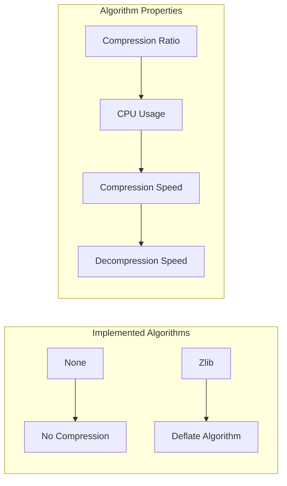
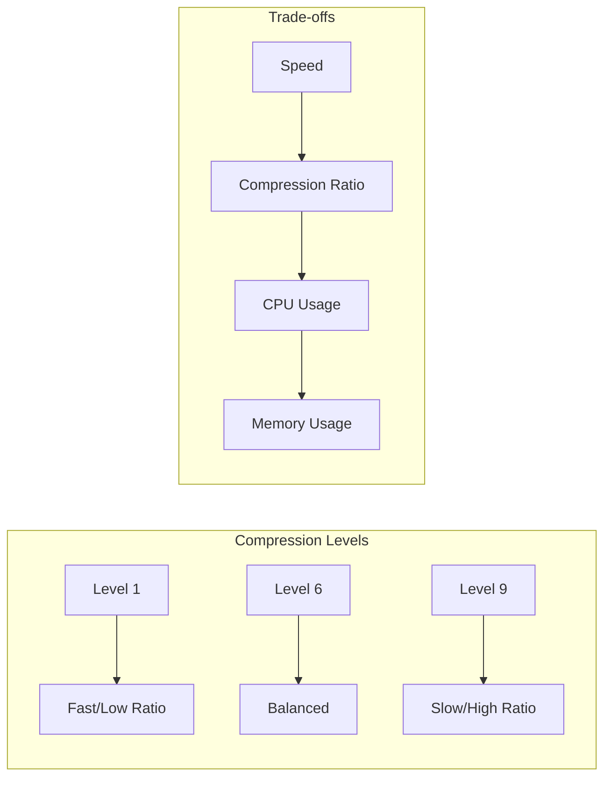
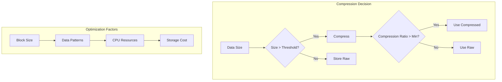
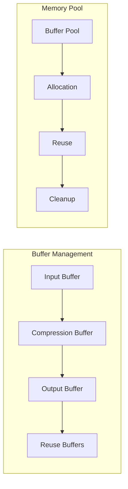
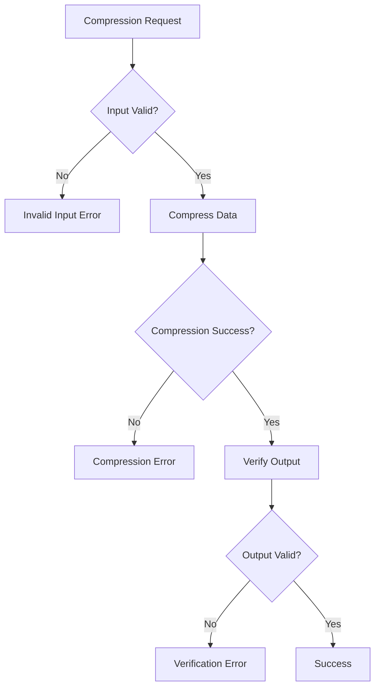
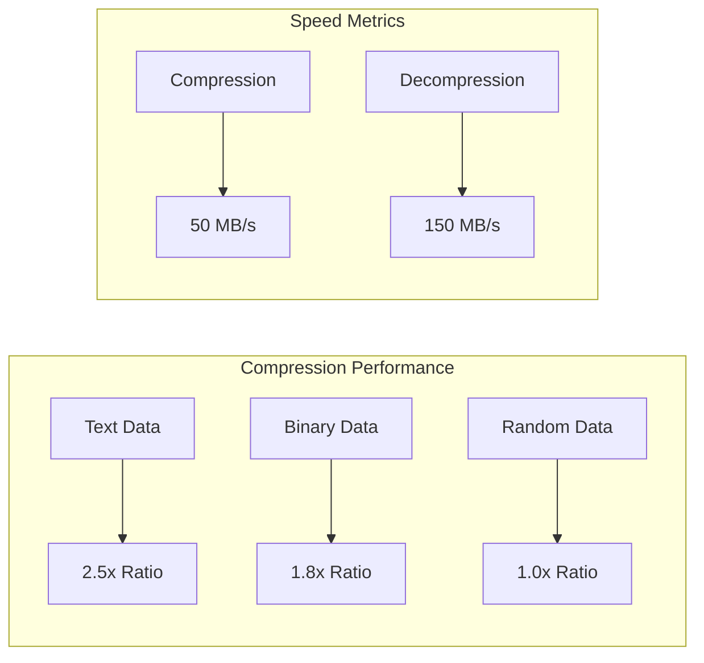

# Compression

Wombat supports data compression to reduce storage requirements and improve I/O performance. This document covers compression algorithms, configuration, and performance characteristics.

## Compression Overview


## Supported Algorithms

### Currently Supported



### Algorithm Characteristics

| Algorithm | Compression Ratio | CPU Usage | Compress Speed | Decompress Speed | Status |
|-----------|-------------------|-----------|----------------|------------------|---------|
| None      | 1.0x              | None      | Fastest        | Fastest          | Implemented |
| Zlib      | 2-4x              | Medium    | Medium         | Fast             | Implemented |

**Note**: Additional compression algorithms (LZ4, Snappy, Zstd) are not yet implemented but can be added to the compression framework.

## Configuration

### Basic Configuration

```zig
const wombat = @import("wombat");

// Disable compression
const options = wombat.Options.default("/path/to/db")
    .withCompression(.none);

// Enable zlib compression
const options = wombat.Options.default("/path/to/db")
    .withCompression(.zlib)
    .withCompressionLevel(6);
```

### Compression Levels



### Level Recommendations

- **Level 1-3**: Fast compression, lower ratios
- **Level 4-6**: Balanced (recommended for most use cases)
- **Level 7-9**: High compression, slower performance

## Implementation Details

### Compression Interface

```zig
pub const CompressionType = enum {
    none,
    zlib,
};

pub const Compressor = struct {
    algorithm: CompressionType,
    level: i32,
    allocator: std.mem.Allocator,
    
    pub fn init(allocator: std.mem.Allocator, algorithm: CompressionType) Compressor {
        return Compressor{
            .algorithm = algorithm,
            .level = 6, // Default level
            .allocator = allocator,
        };
    }
    
    pub fn compress(self: *Compressor, data: []const u8, output: []u8) !usize {
        switch (self.algorithm) {
            .none => {
                @memcpy(output[0..data.len], data);
                return data.len;
            },
            .zlib => {
                return self.compressZlib(data, output);
            },
        }
    }
    
    pub fn decompress(self: *Compressor, compressed: []const u8, output: []u8) !usize {
        switch (self.algorithm) {
            .none => {
                @memcpy(output[0..compressed.len], compressed);
                return compressed.len;
            },
            .zlib => {
                return self.decompressZlib(compressed, output);
            },
        }
    }
};
```

### Block-Level Compression


### Compression Metadata

```zig
pub const CompressionInfo = struct {
    algorithm: CompressionType,
    compressed_size: u32,
    uncompressed_size: u32,
    checksum: u32,
    
    pub fn encode(self: CompressionInfo) [16]u8 {
        var buffer: [16]u8 = undefined;
        std.mem.writeIntLittle(u32, buffer[0..4], @intFromEnum(self.algorithm));
        std.mem.writeIntLittle(u32, buffer[4..8], self.compressed_size);
        std.mem.writeIntLittle(u32, buffer[8..12], self.uncompressed_size);
        std.mem.writeIntLittle(u32, buffer[12..16], self.checksum);
        return buffer;
    }
    
    pub fn decode(data: []const u8) CompressionInfo {
        return CompressionInfo{
            .algorithm = @enumFromInt(std.mem.readIntLittle(u32, data[0..4])),
            .compressed_size = std.mem.readIntLittle(u32, data[4..8]),
            .uncompressed_size = std.mem.readIntLittle(u32, data[8..12]),
            .checksum = std.mem.readIntLittle(u32, data[12..16]),
        };
    }
};
```

## Performance Optimization

### Compression Strategy



### Adaptive Compression

```zig
pub const AdaptiveCompressor = struct {
    compressor: Compressor,
    min_compression_ratio: f32,
    min_block_size: usize,
    
    pub fn compressBlock(self: *AdaptiveCompressor, data: []const u8, output: []u8) !usize {
        // Skip compression for small blocks
        if (data.len < self.min_block_size) {
            @memcpy(output[0..data.len], data);
            return data.len;
        }
        
        // Try compression
        const compressed_size = try self.compressor.compress(data, output);
        const ratio = @as(f32, @floatFromInt(data.len)) / @as(f32, @floatFromInt(compressed_size));
        
        // Use compression only if ratio is good enough
        if (ratio >= self.min_compression_ratio) {
            return compressed_size;
        } else {
            // Fallback to raw data
            @memcpy(output[0..data.len], data);
            return data.len;
        }
    }
};
```

## Memory Management

### Compression Buffers



### Buffer Pool Implementation

```zig
pub const CompressionBufferPool = struct {
    const Buffer = struct {
        data: []u8,
        in_use: bool,
    };
    
    buffers: std.ArrayList(Buffer),
    allocator: std.mem.Allocator,
    buffer_size: usize,
    
    pub fn acquire(self: *CompressionBufferPool) ![]u8 {
        // Find an unused buffer
        for (self.buffers.items) |*buffer| {
            if (!buffer.in_use) {
                buffer.in_use = true;
                return buffer.data;
            }
        }
        
        // Allocate new buffer if none available
        const new_buffer = try self.allocator.alloc(u8, self.buffer_size);
        try self.buffers.append(Buffer{
            .data = new_buffer,
            .in_use = true,
        });
        
        return new_buffer;
    }
    
    pub fn release(self: *CompressionBufferPool, buffer: []u8) void {
        for (self.buffers.items) |*buf| {
            if (buf.data.ptr == buffer.ptr) {
                buf.in_use = false;
                return;
            }
        }
    }
};
```

## Error Handling

### Compression Errors



### Error Recovery

```zig
pub const CompressionError = error{
    InvalidInput,
    CompressionFailed,
    DecompressionFailed,
    CorruptedData,
    InsufficientSpace,
};

pub fn safeCompress(compressor: *Compressor, data: []const u8, output: []u8) !usize {
    // Validate input
    if (data.len == 0) return CompressionError.InvalidInput;
    if (output.len < data.len) return CompressionError.InsufficientSpace;
    
    // Try compression
    const compressed_size = compressor.compress(data, output) catch |err| {
        std.log.warn("Compression failed: {}, falling back to raw storage", .{err});
        
        // Fallback to raw storage
        if (output.len < data.len) return CompressionError.InsufficientSpace;
        @memcpy(output[0..data.len], data);
        return data.len;
    };
    
    // Verify compression worked
    if (compressed_size > data.len) {
        std.log.debug("Compression increased size, using raw storage");
        @memcpy(output[0..data.len], data);
        return data.len;
    }
    
    return compressed_size;
}
```

## Performance Benchmarks

### Compression Benchmarks

```bash
# Run compression benchmarks
zig build benchmark -- --filter compression

# Compare different algorithms
zig build benchmark -- --compression-test

# Profile compression performance
zig build benchmark -- --profile-compression
```

### Benchmark Results



## Best Practices

### When to Use Compression


### Configuration Guidelines

1. **Development**: Use `none` for faster iteration
2. **Production**: Use `zlib` level 6 for balanced performance
3. **Storage-constrained**: Use `zlib` level 9 for maximum compression
4. **CPU-constrained**: Use `zlib` level 1-3 for faster compression

### Monitoring Compression

```zig
pub const CompressionStats = struct {
    total_compressed: u64,
    total_uncompressed: u64,
    compression_time_ns: u64,
    decompression_time_ns: u64,
    
    pub fn compressionRatio(self: CompressionStats) f64 {
        if (self.total_compressed == 0) return 1.0;
        return @as(f64, @floatFromInt(self.total_uncompressed)) / 
               @as(f64, @floatFromInt(self.total_compressed));
    }
    
    pub fn compressionThroughput(self: CompressionStats) f64 {
        if (self.compression_time_ns == 0) return 0.0;
        const seconds = @as(f64, @floatFromInt(self.compression_time_ns)) / 1e9;
        return @as(f64, @floatFromInt(self.total_uncompressed)) / seconds;
    }
};
```

## Future Enhancements

### Planned Algorithms

- **LZ4**: Ultra-fast compression/decompression
- **Snappy**: Google's fast compressor
- **Zstd**: Facebook's modern compression algorithm

### Advanced Features

- **Dictionary compression**: Shared dictionaries for better ratios
- **Streaming compression**: For large values
- **Parallel compression**: Multi-threaded compression
- **Adaptive algorithms**: Algorithm selection based on data patterns

This comprehensive compression system provides flexible, efficient data compression with multiple algorithms and optimization strategies for different use cases.