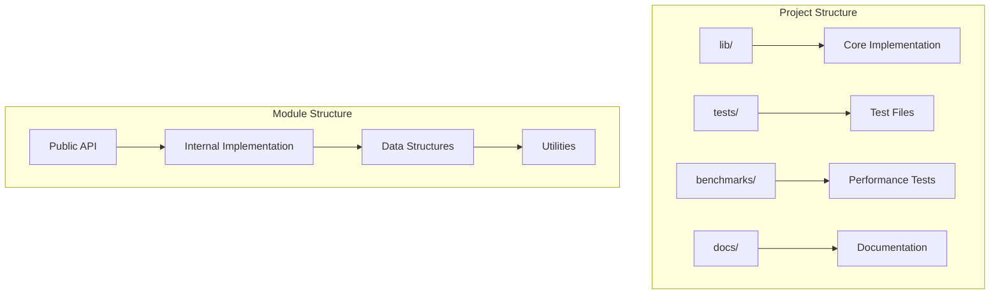
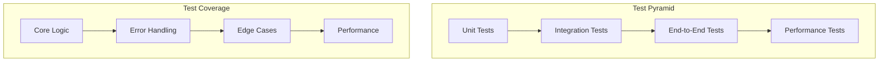
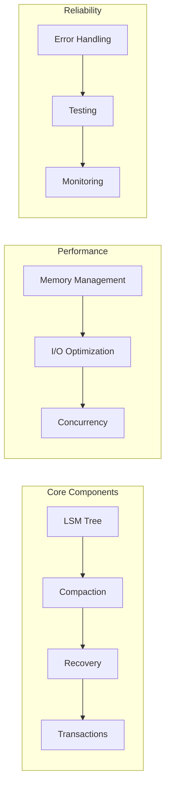

# Contributing to Wombat

Thank you for your interest in contributing to Wombat! This guide will help you get started with contributing to the project.

## Getting Started

### Prerequisites

- **Zig 0.15+**: Download from [ziglang.org](https://ziglang.org/download/)
- **Git**: For version control
- **Basic LSM-Tree knowledge**: Understanding of log-structured storage

### Development Setup

```bash
# Fork and clone the repository
git clone https://github.com/YOUR_USERNAME/wombat.git
cd wombat

# Build the project
zig build

# Run tests to ensure everything works
zig build test

# Run benchmarks
zig build benchmark
```

### Editor Setup

#### VS Code Configuration
```json
{
    "zig.buildOnSave": true,
    "zig.checkForUpdate": false,
    "zig.enableSemanticTokens": true,
    "files.associations": {
        "*.zig": "zig"
    },
    "editor.formatOnSave": true
}
```

## Code Style Guidelines

### Formatting
- Use `zig fmt` to format all code
- Follow standard Zig naming conventions
- Keep line length under 100 characters

### Code Organization



### Naming Conventions

```zig
// Types: PascalCase
pub const SkipList = struct { ... };

// Functions: camelCase
pub fn insertValue(self: *Self, key: []const u8, value: []const u8) !void { ... }

// Variables: snake_case
const max_level = 16;
var current_node = head;

// Constants: SCREAMING_SNAKE_CASE
const MAX_LEVEL = 16;
const DEFAULT_BLOCK_SIZE = 4096;
```

## Testing Requirements

### Test Categories



### Writing Tests

```zig
const std = @import("std");
const testing = std.testing;
const expect = testing.expect;
const expectEqual = testing.expectEqual;

test "skiplist basic operations" {
    var gpa = std.heap.GeneralPurposeAllocator(.{}){}; 
    defer _ = gpa.deinit();
    const allocator = gpa.allocator();
    
    var skiplist = try SkipList.init(allocator, 1024 * 1024);
    defer skiplist.deinit();
    
    // Test insertion
    try skiplist.put("key1", ValueStruct{ .value = "value1", .timestamp = 100 });
    
    // Test retrieval
    const result = skiplist.get("key1");
    try expect(result != null);
    try expectEqual(result.?.timestamp, 100);
    
    // Test deletion
    try skiplist.delete("key1");
    const deleted = skiplist.get("key1");
    try expect(deleted == null);
}
```

### Running Tests

```bash
# Run all tests
zig build test

# Run specific test
zig build test -- --test-filter "skiplist"

# Run with coverage
zig build test -- --test-coverage

# Run with memory leak detection
zig build test -- --test-leak-check
```

## Pull Request Process

### PR Checklist

- [ ] Code follows style guidelines
- [ ] Tests are written and passing
- [ ] Documentation is updated
- [ ] Commit messages are clear
- [ ] No debug code or TODOs
- [ ] Performance impact considered

### Commit Message Format

```
type: brief description

Detailed explanation of changes made.
Include motivation and context.

- Bullet points for key changes
- Reference issues with #123
```

**Types:**
- `feat`: New feature
- `fix`: Bug fix  
- `docs`: Documentation changes
- `style`: Code style changes
- `refactor`: Code refactoring
- `test`: Test additions/changes
- `perf`: Performance improvements

## Development Areas

### High Priority Areas



### Contribution Ideas

#### For Beginners
- Documentation improvements
- Test coverage expansion
- Code comments and examples
- Bug fixes in non-critical paths

#### For Intermediate
- Performance optimizations
- New configuration options
- Error handling improvements
- Monitoring and metrics

#### For Advanced
- Compaction strategy improvements
- Transaction system enhancements
- Crash recovery optimization
- Concurrency improvements

## Code Review Guidelines

### Review Checklist

#### Functionality
- [ ] Code solves the stated problem
- [ ] Edge cases are handled
- [ ] Error conditions are proper
- [ ] Performance impact is acceptable

#### Code Quality
- [ ] Code is readable and maintainable
- [ ] Functions are properly sized
- [ ] Comments explain complex logic
- [ ] No duplicate code

#### Testing
- [ ] Tests cover new functionality
- [ ] Tests cover error conditions
- [ ] Tests are deterministic
- [ ] Performance tests if applicable

## Communication

### Channels
- **GitHub Issues**: Bug reports, feature requests
- **GitHub Discussions**: General questions, ideas
- **Pull Requests**: Code changes, reviews

### Memory Usage

```zig
// Always use appropriate allocators
test "memory usage example" {
    var gpa = std.heap.GeneralPurposeAllocator(.{}){}; 
    defer _ = gpa.deinit();
    const allocator = gpa.allocator();
    
    // Track memory usage
    const before = gpa.total_requested_bytes;
    
    // Your code here
    var data = try allocator.alloc(u8, 1024);
    defer allocator.free(data);
    
    const after = gpa.total_requested_bytes;
    const used = after - before;
    
    // Verify memory usage is reasonable
    try expect(used <= 2048); // Allow some overhead
}
```

## Documentation

### Documentation Standards
- All public APIs must be documented
- Use clear, concise language
- Include examples for complex features
- Update docs with code changes

### Documentation Format

```zig
/// Inserts a key-value pair into the skiplist.
/// 
/// This function will overwrite any existing value for the given key.
/// The key and value are copied into the skiplist's memory.
/// 
/// Arguments:
///   key: The key to insert (must be valid UTF-8)
///   value: The value to associate with the key
/// 
/// Returns:
///   void on success
///   error.OutOfMemory if allocation fails
///   error.InvalidKey if key is invalid
/// 
/// Example:
///   var skiplist = try SkipList.init(allocator, 1024);
///   try skiplist.put("hello", "world");
pub fn put(self: *Self, key: []const u8, value: []const u8) !void {
    // Implementation...
}
```

## Release Process

### Version Numbering
- Follow semantic versioning (SemVer)
- Format: `MAJOR.MINOR.PATCH`
- Breaking changes increment MAJOR
- New features increment MINOR
- Bug fixes increment PATCH


Thank you for contributing to Wombat! Your contributions help make this project better for everyone.
