# Data Structures

This document details the internal data structures and algorithms used in Wombat's implementation.

## Core Data Structures Overview

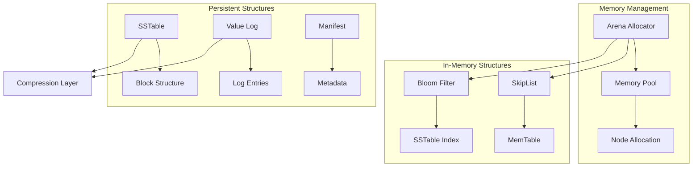

## Arena Allocator

The Arena allocator provides efficient memory management for frequently allocated data structures.

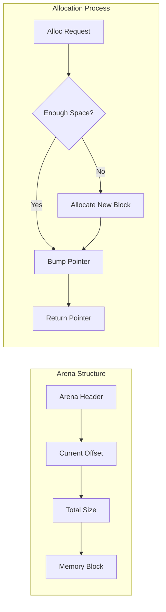

### Implementation Details

```zig
pub const Arena = struct {
    blocks: std.ArrayList([]u8),
    current_block: usize,
    current_offset: usize,
    block_size: usize,
    total_allocated: usize,
    
    pub fn alloc(self: *Arena, comptime T: type, count: usize) ![]T {
        const size = @sizeOf(T) * count;
        const alignment = @alignOf(T);
        
        // Align the current offset
        const aligned_offset = std.mem.alignForward(self.current_offset, alignment);
        
        // Check if we have enough space
        if (aligned_offset + size > self.block_size) {
            try self.allocateNewBlock();
        }
        
        // Return the allocated memory
        const ptr = self.blocks.items[self.current_block].ptr + aligned_offset;
        self.current_offset = aligned_offset + size;
        self.total_allocated += size;
        
        return @ptrCast(@alignCast(ptr))[0..count];
    }
};
```

## SkipList

The SkipList provides the foundation for the MemTable with O(log n) operations.

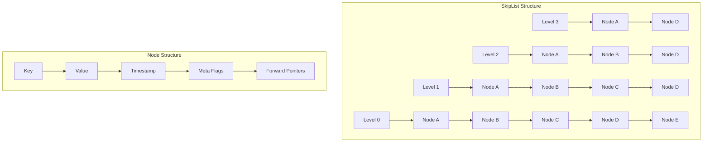

### Skip List Operations

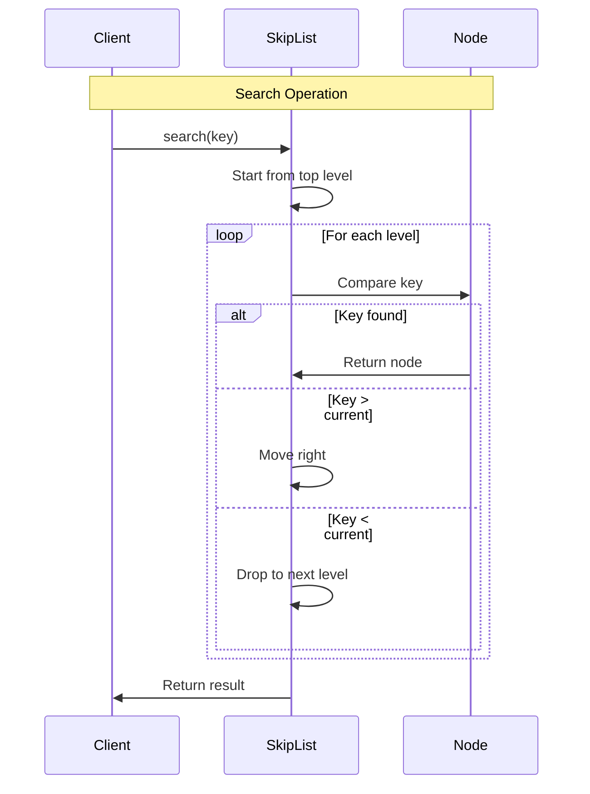

### Implementation Details

```zig
pub const SkipList = struct {
    const MAX_LEVEL = 16;
    const PROBABILITY = 0.5;
    
    pub const Node = struct {
        key: []const u8,
        value: ValueStruct,
        forward: [MAX_LEVEL]?*Node,
        level: u8,
    };
    
    head: *Node,
    level: u8,
    size: usize,
    arena: *Arena,
    
    pub fn search(self: *const SkipList, key: []const u8) ?*Node {
        var current = self.head;
        
        var i: i32 = @intCast(self.level);
        while (i >= 0) : (i -= 1) {
            const level_idx = @intCast(i);
            while (current.forward[level_idx]) |next| {
                const cmp = std.mem.order(u8, key, next.key);
                if (cmp == .gt) {
                    current = next;
                } else if (cmp == .eq) {
                    return next;
                } else {
                    break;
                }
            }
        }
        
        return null;
    }
};
```

## Bloom Filter

Bloom filters provide probabilistic membership testing to avoid unnecessary disk I/O.

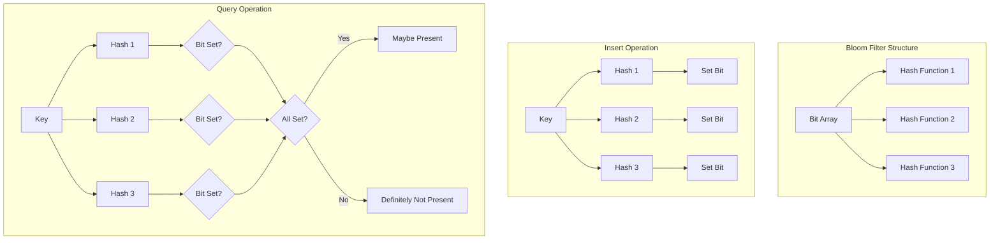

### Implementation Details

```zig
pub const BloomFilter = struct {
    bits: []u8,
    num_hashes: u32,
    num_bits: u32,
    
    pub fn insert(self: *BloomFilter, key: []const u8) void {
        const hash1 = std.hash.Fnv1a_64.hash(key);
        const hash2 = std.hash.Wyhash.hash(0, key);
        
        for (0..self.num_hashes) |i| {
            const hash = hash1 +% (@as(u64, @intCast(i)) * hash2);
            const bit_index = hash % self.num_bits;
            const byte_index = bit_index / 8;
            const bit_offset = @intCast(bit_index % 8);
            
            self.bits[byte_index] |= (@as(u8, 1) << bit_offset);
        }
    }
    
    pub fn contains(self: *const BloomFilter, key: []const u8) bool {
        const hash1 = std.hash.Fnv1a_64.hash(key);
        const hash2 = std.hash.Wyhash.hash(0, key);
        
        for (0..self.num_hashes) |i| {
            const hash = hash1 +% (@as(u64, @intCast(i)) * hash2);
            const bit_index = hash % self.num_bits;
            const byte_index = bit_index / 8;
            const bit_offset = @intCast(bit_index % 8);
            
            if ((self.bits[byte_index] & (@as(u8, 1) << bit_offset)) == 0) {
                return false;
            }
        }
        
        return true;
    }
};
```

## SSTable Structure

SSTables store sorted key-value pairs with efficient indexing and compression.

```mermaid
graph TB
    subgraph "SSTable File Format"
        A[Header] --> B[Data Blocks]
        B --> C[Index Block]
        C --> D[Bloom Filter]
        D --> E[Footer]
    end
    
    subgraph "Data Block Structure"
        F[Block Header] --> G[Key-Value Pairs]
        G --> H[Restart Points]
        H --> I[Block Footer]
    end
    
    subgraph "Index Structure"
        J[Index Entry] --> K[Last Key]
        K --> L[Block Offset]
        L --> M[Block Size]
    end
```

### Block Layout

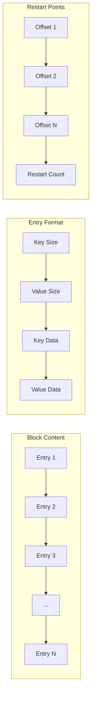

## Value Log Structure

The Value Log stores large values separately to reduce write amplification.

```mermaid
graph TB
    subgraph "Value Log File"
        A[File Header] --> B[Entry 1]
        B --> C[Entry 2]
        C --> D[Entry 3]
        D --> E[...]
        E --> F[Entry N]
    end
    
    subgraph "Entry Format"
        G[CRC32] --> H[Timestamp]
        H --> I[Key Size]
        I --> J[Value Size]
        J --> K[Key Data]
        K --> L[Value Data]
    end
    
    subgraph "Pointer Structure"
        M[File ID] --> N[Offset]
        N --> O[Size]
        O --> P[Timestamp]
    end
```

### Space Reclaim Process

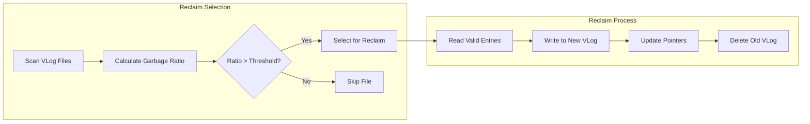

## Manifest Structure

The Manifest tracks metadata about SSTable files and database state.

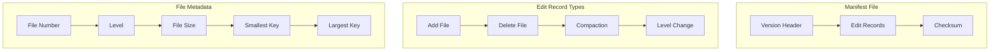

## Compression Layer

Data compression is applied at the block level for space efficiency.

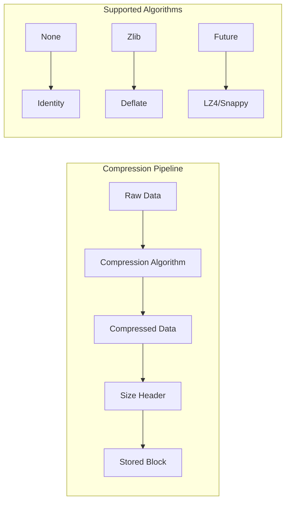

## Memory Layout

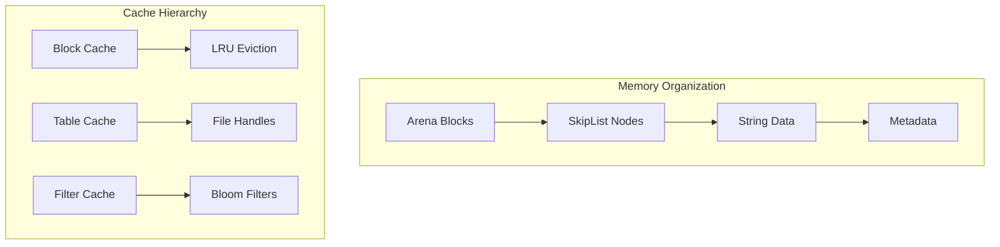

## Algorithm Complexity

| Operation | Time Complexity | Space Complexity |
|-----------|----------------|------------------|
| SkipList Insert | O(log n) | O(1) |
| SkipList Search | O(log n) | O(1) |
| Bloom Filter Insert | O(k) | O(1) |
| Bloom Filter Query | O(k) | O(1) |
| SSTable Search | O(log n) | O(1) |
| Compaction | O(n log n) | O(n) |

Where:
- n = number of elements
- k = number of hash functions

This comprehensive overview of data structures provides the foundation for understanding Wombat's high-performance storage engine implementation.