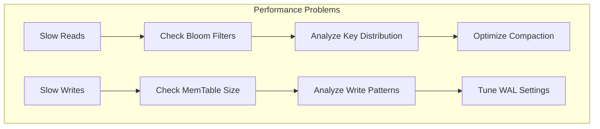
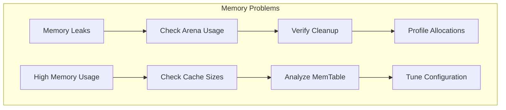

# Debugging Guide

This guide covers debugging techniques, tools, and troubleshooting procedures for Wombat development and deployment.

## Debug Build Configuration

### Debug Builds

```bash
# Debug build with symbols
zig build -Doptimize=Debug

# Debug with additional logging
zig build -Doptimize=Debug -Ddebug-logging=true

# Debug with memory sanitizer
zig build -Doptimize=Debug -Dsanitize-memory=true
```

### Debug Flags

```zig
pub const DebugConfig = struct {
    enable_debug_logging: bool = false,
    enable_memory_tracking: bool = false,
    enable_performance_tracking: bool = false,
    enable_operation_tracing: bool = false,
    
    // Debug levels
    debug_level: enum { minimal, verbose, full } = .minimal,
    
    // Component-specific debugging
    debug_compaction: bool = false,
    debug_recovery: bool = false,
    debug_space_reclaim: bool = false,
};
```

## Debugging Tools

### Built-in Debugging

```zig
pub const Debugger = struct {
    db: *DB,
    
    pub fn dumpMemTable(self: *Debugger) void {
        std.log.info("=== MemTable Dump ===");
        var iterator = self.db.mem_table.iterator();
        
        while (iterator.next()) |entry| {
            std.log.info("Key: {s}, Value: {s}, TS: {}", 
                         .{entry.key, entry.value.value, entry.value.timestamp});
        }
    }
    
    pub fn dumpLevelStats(self: *Debugger) void {
        std.log.info("=== Level Statistics ===");
        
        for (0..self.db.options.max_levels) |level| {
            const files = self.db.manifest.getFilesAtLevel(@intCast(level));
            var total_size: u64 = 0;
            
            for (files) |file| {
                total_size += file.size;
            }
            
            std.log.info("L{}: {} files, {} bytes", .{level, files.len, total_size});
        }
    }
    
    pub fn analyzeKeyDistribution(self: *Debugger) void {
        std.log.info("=== Key Distribution Analysis ===");
        
        var key_counts = std.HashMap(u8, u32, std.hash_map.DefaultContext(u8)).init(self.db.allocator);
        defer key_counts.deinit();
        
        // Analyze first character distribution
        var iterator = self.db.mem_table.iterator();
        while (iterator.next()) |entry| {
            if (entry.key.len > 0) {
                const first_char = entry.key[0];
                const count = key_counts.get(first_char) orelse 0;
                key_counts.put(first_char, count + 1) catch {};
            }
        }
        
        var char_iter = key_counts.iterator();
        while (char_iter.next()) |kv| {
            std.log.info("'{c}': {} keys", .{kv.key_ptr.*, kv.value_ptr.*});
        }
    }
};
```

## Memory Debugging

### Memory Leak Detection

```bash
# Run with leak detection
zig build test -- --test-leak-check

# Run with memory sanitizer
zig build -Doptimize=Debug -Dsanitize-memory=true test
```

### Memory Profiling

```zig
pub const MemoryProfiler = struct {
    allocations: std.ArrayList(Allocation),
    total_allocated: u64,
    peak_usage: u64,
    
    const Allocation = struct {
        ptr: usize,
        size: usize,
        timestamp: i64,
        stack_trace: []usize,
    };
    
    pub fn trackAllocation(self: *MemoryProfiler, ptr: usize, size: usize) void {
        const allocation = Allocation{
            .ptr = ptr,
            .size = size,
            .timestamp = std.time.milliTimestamp(),
            .stack_trace = self.captureStackTrace(),
        };
        
        self.allocations.append(allocation) catch {};
        self.total_allocated += size;
        
        if (self.total_allocated > self.peak_usage) {
            self.peak_usage = self.total_allocated;
        }
    }
    
    pub fn dumpMemoryUsage(self: *MemoryProfiler) void {
        std.log.info("=== Memory Usage ===");
        std.log.info("Total allocated: {} bytes", .{self.total_allocated});
        std.log.info("Peak usage: {} bytes", .{self.peak_usage});
        std.log.info("Active allocations: {}", .{self.allocations.items.len});
    }
};
```

## Performance Debugging

### Performance Profiling

```bash
# Profile with perf
perf record --call-graph=dwarf zig build benchmark
perf report

# Profile with valgrind
valgrind --tool=callgrind zig build benchmark
kcachegrind callgrind.out.*
```

### Performance Tracing

```zig
pub const PerformanceTracer = struct {
    traces: std.ArrayList(TraceEvent),
    
    const TraceEvent = struct {
        name: []const u8,
        start_time: i64,
        end_time: i64,
        thread_id: u32,
        
        pub fn duration(self: TraceEvent) i64 {
            return self.end_time - self.start_time;
        }
    };
    
    pub fn startTrace(self: *PerformanceTracer, name: []const u8) TraceHandle {
        return TraceHandle{
            .tracer = self,
            .name = name,
            .start_time = std.time.nanoTimestamp(),
        };
    }
    
    pub const TraceHandle = struct {
        tracer: *PerformanceTracer,
        name: []const u8,
        start_time: i64,
        
        pub fn end(self: TraceHandle) void {
            const event = TraceEvent{
                .name = self.name,
                .start_time = self.start_time,
                .end_time = std.time.nanoTimestamp(),
                .thread_id = std.Thread.getCurrentId(),
            };
            
            self.tracer.traces.append(event) catch {};
        }
    };
};
```

## Error Debugging

### Error Context

```zig
pub const ErrorContext = struct {
    error_type: anyerror,
    message: []const u8,
    stack_trace: []usize,
    timestamp: i64,
    operation: []const u8,
    key: ?[]const u8,
    
    pub fn create(err: anyerror, operation: []const u8, key: ?[]const u8, message: []const u8) ErrorContext {
        return ErrorContext{
            .error_type = err,
            .message = message,
            .stack_trace = captureStackTrace(),
            .timestamp = std.time.milliTimestamp(),
            .operation = operation,
            .key = key,
        };
    }
    
    pub fn format(self: ErrorContext, writer: anytype) !void {
        try writer.print("Error: {} in operation '{}'\n", .{self.error_type, self.operation});
        try writer.print("Message: {s}\n", .{self.message});
        if (self.key) |key| {
            try writer.print("Key: {s}\n", .{key});
        }
        try writer.print("Timestamp: {}\n", .{self.timestamp});
        
        try writer.print("Stack trace:\n");
        for (self.stack_trace) |addr| {
            try writer.print("  0x{x}\n", .{addr});
        }
    }
};
```

## Logging and Tracing

### Debug Logging

```zig
pub const DebugLogger = struct {
    level: LogLevel,
    output: std.fs.File,
    
    pub fn logOperation(self: *DebugLogger, operation: []const u8, key: []const u8, duration_ns: u64) void {
        if (self.level.atLeast(.debug)) {
            const timestamp = std.time.milliTimestamp();
            self.output.writer().print("[{}] {} key='{}' duration={}ns\n", 
                                      .{timestamp, operation, key, duration_ns}) catch {};
        }
    }
    
    pub fn logCompaction(self: *DebugLogger, level: u32, input_files: u32, output_files: u32) void {
        if (self.level.atLeast(.info)) {
            const timestamp = std.time.milliTimestamp();
            self.output.writer().print("[{}] Compaction L{}: {} -> {} files\n", 
                                      .{timestamp, level, input_files, output_files}) catch {};
        }
    }
};
```

## Common Issues and Solutions

### Performance Issues



### Memory Issues



This debugging guide provides comprehensive tools and techniques for identifying and resolving issues in Wombat development and deployment.