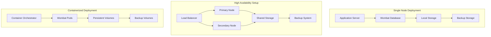
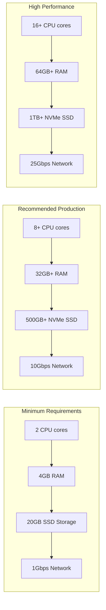
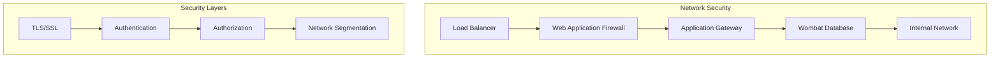
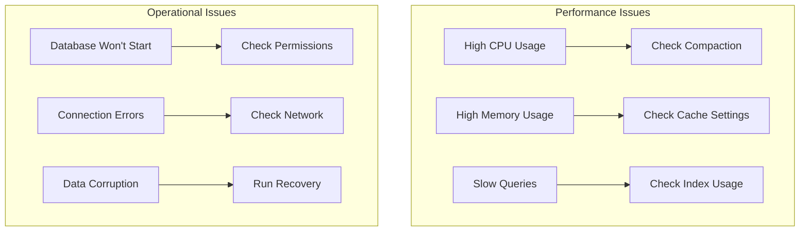

# Deployment Guide

This guide covers deployment strategies, configuration, and operational considerations for Wombat database in production environments.

## Deployment Architecture



## System Requirements

### Hardware Requirements



### Software Requirements

- **Operating System**: Linux (Ubuntu 20.04+, CentOS 8+, RHEL 8+)
- **Zig Compiler**: Version 0.15 or later
- **File System**: ext4, xfs, or btrfs with good SSD support
- **Network**: Low latency, high bandwidth connection
- **Monitoring**: Prometheus, Grafana (optional)

## Installation

### Binary Installation

```bash
# Download and install Wombat
wget https://github.com/cleverra-tech/wombat/releases/latest/download/wombat-linux-x86_64.tar.gz
tar -xzf wombat-linux-x86_64.tar.gz
sudo cp wombat /usr/local/bin/
sudo chmod +x /usr/local/bin/wombat

# Create wombat user
sudo useradd -r -s /bin/false wombat
sudo mkdir -p /var/lib/wombat
sudo chown wombat:wombat /var/lib/wombat
```

### Building from Source

```bash
# Clone repository
git clone https://github.com/cleverra-tech/wombat.git
cd wombat

# Build release binary
zig build -Doptimize=ReleaseFast

# Install binary
sudo cp zig-out/bin/wombat /usr/local/bin/
sudo chmod +x /usr/local/bin/wombat
```

## Configuration

### Production Configuration

```zig
// production.zig
const std = @import("std");
const wombat = @import("wombat");

pub fn main() !void {
    var gpa = std.heap.GeneralPurposeAllocator(.{}){};
    defer _ = gpa.deinit();
    const allocator = gpa.allocator();

    // Production configuration
    const options = wombat.Options.production("/var/lib/wombat")
        .withMemTableSize(256 * 1024 * 1024)  // 256MB
        .withNumCompactors(8)                  // 8 compaction threads
        .withCompression(.zlib)                // Enable compression
        .withSyncWrites(true)                  // Durability
        .withCacheSizes(
            1024 * 1024 * 1024,  // 1GB block cache
            256 * 1024 * 1024,   // 256MB table cache
            64 * 1024 * 1024     // 64MB filter cache
        )
        .withLogLevel(.info);

    var db = try wombat.DB.open(allocator, options);
    defer db.close() catch {};

    // Start API server
    try startAPIServer(&db);
}
```

### Configuration File

```json
{
  "database": {
    "path": "/var/lib/wombat",
    "mem_table_size": 268435456,
    "num_compactors": 8,
    "max_levels": 7,
    "compression": "zlib",
    "sync_writes": true
  },
  "cache": {
    "block_cache_size": 1073741824,
    "table_cache_size": 268435456,
    "filter_cache_size": 67108864
  },
  "monitoring": {
    "enable_metrics": true,
    "log_level": "info",
    "prometheus_port": 9090
  },
  "backup": {
    "enabled": true,
    "schedule": "0 2 * * *",
    "retention_days": 30,
    "compression": true
  }
}
```

## Service Management

### Systemd Service

```ini
[Unit]
Description=Wombat Database
After=network.target

[Service]
Type=simple
User=wombat
Group=wombat
WorkingDirectory=/var/lib/wombat
ExecStart=/usr/local/bin/wombat --config /etc/wombat/wombat.json
Restart=always
RestartSec=10

# Resource limits
LimitNOFILE=65536
LimitNPROC=32768

# Security
NoNewPrivileges=true
PrivateTmp=true
ProtectSystem=strict
ProtectHome=true
ReadWritePaths=/var/lib/wombat

[Install]
WantedBy=multi-user.target
```

### Service Management Commands

```bash
# Enable and start service
sudo systemctl enable wombat
sudo systemctl start wombat

# Check status
sudo systemctl status wombat

# View logs
sudo journalctl -u wombat -f

# Restart service
sudo systemctl restart wombat

# Stop service
sudo systemctl stop wombat
```

## Docker Deployment

### Dockerfile

```dockerfile
FROM ubuntu:22.04

# Install dependencies
RUN apt-get update && apt-get install -y \
    curl \
    ca-certificates \
    && rm -rf /var/lib/apt/lists/*

# Create wombat user
RUN useradd -r -s /bin/false wombat

# Install Wombat
COPY wombat /usr/local/bin/
RUN chmod +x /usr/local/bin/wombat

# Create directories
RUN mkdir -p /var/lib/wombat /etc/wombat
RUN chown wombat:wombat /var/lib/wombat

# Copy configuration
COPY wombat.json /etc/wombat/

# Expose ports
EXPOSE 8080 9090

# Switch to wombat user
USER wombat

# Health check
HEALTHCHECK --interval=30s --timeout=10s --start-period=5s --retries=3 \
  CMD curl -f http://localhost:8080/health || exit 1

# Start Wombat
CMD ["/usr/local/bin/wombat", "--config", "/etc/wombat/wombat.json"]
```

### Docker Compose

```yaml
version: '3.8'

services:
  wombat:
    build: .
    ports:
      - "8080:8080"
      - "9090:9090"
    volumes:
      - wombat-data:/var/lib/wombat
      - wombat-config:/etc/wombat
      - wombat-logs:/var/log/wombat
    environment:
      - WOMBAT_LOG_LEVEL=info
      - WOMBAT_PROMETHEUS_ENABLED=true
    restart: unless-stopped
    healthcheck:
      test: ["CMD", "curl", "-f", "http://localhost:8080/health"]
      interval: 30s
      timeout: 10s
      retries: 3
    
  prometheus:
    image: prom/prometheus:latest
    ports:
      - "9091:9090"
    volumes:
      - ./prometheus.yml:/etc/prometheus/prometheus.yml
      - prometheus-data:/prometheus
    depends_on:
      - wombat
    
  grafana:
    image: grafana/grafana:latest
    ports:
      - "3000:3000"
    volumes:
      - grafana-data:/var/lib/grafana
      - ./grafana/dashboards:/etc/grafana/provisioning/dashboards
    environment:
      - GF_SECURITY_ADMIN_PASSWORD=admin
    depends_on:
      - prometheus

volumes:
  wombat-data:
  wombat-config:
  wombat-logs:
  prometheus-data:
  grafana-data:
```

## Kubernetes Deployment

### Deployment Manifest

```yaml
apiVersion: apps/v1
kind: Deployment
metadata:
  name: wombat-db
  labels:
    app: wombat-db
spec:
  replicas: 1
  selector:
    matchLabels:
      app: wombat-db
  template:
    metadata:
      labels:
        app: wombat-db
    spec:
      containers:
      - name: wombat
        image: wombat:latest
        ports:
        - containerPort: 8080
        - containerPort: 9090
        env:
        - name: WOMBAT_LOG_LEVEL
          value: "info"
        volumeMounts:
        - name: wombat-data
          mountPath: /var/lib/wombat
        - name: wombat-config
          mountPath: /etc/wombat
        resources:
          requests:
            memory: "2Gi"
            cpu: "1000m"
          limits:
            memory: "8Gi"
            cpu: "4000m"
        livenessProbe:
          httpGet:
            path: /health
            port: 8080
          initialDelaySeconds: 30
          periodSeconds: 10
        readinessProbe:
          httpGet:
            path: /ready
            port: 8080
          initialDelaySeconds: 5
          periodSeconds: 5
      volumes:
      - name: wombat-data
        persistentVolumeClaim:
          claimName: wombat-data-pvc
      - name: wombat-config
        configMap:
          name: wombat-config
```

### Persistent Volume Claim

```yaml
apiVersion: v1
kind: PersistentVolumeClaim
metadata:
  name: wombat-data-pvc
spec:
  accessModes:
    - ReadWriteOnce
  resources:
    requests:
      storage: 500Gi
  storageClassName: fast-ssd
```

### Service

```yaml
apiVersion: v1
kind: Service
metadata:
  name: wombat-service
spec:
  selector:
    app: wombat-db
  ports:
    - name: api
      port: 8080
      targetPort: 8080
    - name: metrics
      port: 9090
      targetPort: 9090
  type: ClusterIP
```

## Performance Tuning

### OS-Level Optimizations

```bash
# Kernel parameters for high performance
echo 'net.core.rmem_max = 134217728' >> /etc/sysctl.conf
echo 'net.core.wmem_max = 134217728' >> /etc/sysctl.conf
echo 'net.ipv4.tcp_rmem = 4096 87380 134217728' >> /etc/sysctl.conf
echo 'net.ipv4.tcp_wmem = 4096 65536 134217728' >> /etc/sysctl.conf
echo 'vm.swappiness = 10' >> /etc/sysctl.conf
echo 'vm.dirty_ratio = 15' >> /etc/sysctl.conf
echo 'vm.dirty_background_ratio = 5' >> /etc/sysctl.conf

# Apply settings
sysctl -p

# I/O scheduler optimization for SSDs
echo 'noop' > /sys/block/nvme0n1/queue/scheduler

# CPU governor
echo 'performance' > /sys/devices/system/cpu/cpu*/cpufreq/scaling_governor
```

### File System Optimization

```bash
# Mount options for ext4
mount -o noatime,nodiratime,data=ordered,barrier=0 /dev/nvme0n1 /var/lib/wombat

# Add to /etc/fstab
echo '/dev/nvme0n1 /var/lib/wombat ext4 noatime,nodiratime,data=ordered,barrier=0 0 2' >> /etc/fstab

# For XFS
mount -o noatime,nodiratime,nobarrier,logbufs=8,logbsize=32k /dev/nvme0n1 /var/lib/wombat
```

## Security

### Network Security



### Security Configuration

```bash
# Firewall rules
ufw allow 22/tcp      # SSH
ufw allow 8080/tcp    # Wombat API
ufw allow 9090/tcp    # Prometheus metrics
ufw enable

# SSL/TLS configuration
openssl req -x509 -nodes -days 365 -newkey rsa:2048 \
  -keyout /etc/ssl/private/wombat.key \
  -out /etc/ssl/certs/wombat.crt

# Set proper permissions
chmod 600 /etc/ssl/private/wombat.key
chmod 644 /etc/ssl/certs/wombat.crt
```

## Monitoring and Alerting

### Prometheus Configuration

```yaml
# prometheus.yml
global:
  scrape_interval: 15s

scrape_configs:
  - job_name: 'wombat'
    static_configs:
      - targets: ['localhost:9090']
    scrape_interval: 5s
    metrics_path: /metrics
```

### Grafana Dashboard

```json
{
  "dashboard": {
    "title": "Wombat Database",
    "panels": [
      {
        "title": "Operations/sec",
        "targets": [
          {
            "expr": "rate(wombat_operations_total[1m])",
            "legendFormat": "{{operation}}"
          }
        ]
      },
      {
        "title": "Latency",
        "targets": [
          {
            "expr": "wombat_operation_duration_seconds",
            "legendFormat": "{{quantile}}"
          }
        ]
      },
      {
        "title": "Memory Usage",
        "targets": [
          {
            "expr": "wombat_memory_usage_bytes",
            "legendFormat": "{{component}}"
          }
        ]
      }
    ]
  }
}
```

## Backup and Recovery

### Automated Backup

```bash
#!/bin/bash
# /usr/local/bin/wombat-backup.sh

DB_PATH="/var/lib/wombat"
BACKUP_PATH="/backup/wombat"
DATE=$(date +%Y%m%d_%H%M%S)

# Create backup
mkdir -p "$BACKUP_PATH"
tar -czf "$BACKUP_PATH/wombat_backup_$DATE.tar.gz" -C "$DB_PATH" .

# Upload to cloud storage (optional)
aws s3 cp "$BACKUP_PATH/wombat_backup_$DATE.tar.gz" s3://my-backup-bucket/wombat/

# Cleanup old backups
find "$BACKUP_PATH" -name "wombat_backup_*.tar.gz" -mtime +7 -delete
```

## Troubleshooting

### Common Issues



### Debug Commands

```bash
# Check database status
systemctl status wombat

# View logs
journalctl -u wombat -f

# Check resource usage
top -p $(pgrep wombat)
iostat -x 1

# Network diagnostics
netstat -tlnp | grep 8080
ss -tlnp | grep 8080

# Database health check
curl http://localhost:8080/health
curl http://localhost:8080/metrics
```

This comprehensive deployment guide provides everything needed to successfully deploy and operate Wombat database in production environments.