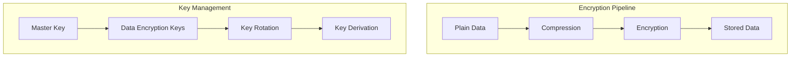
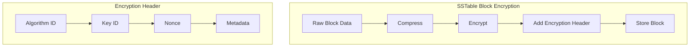
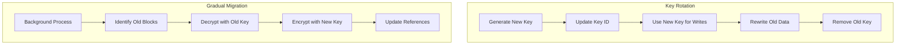
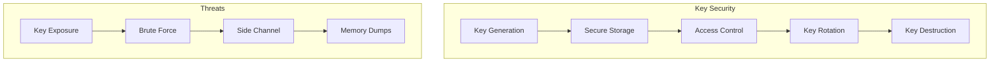
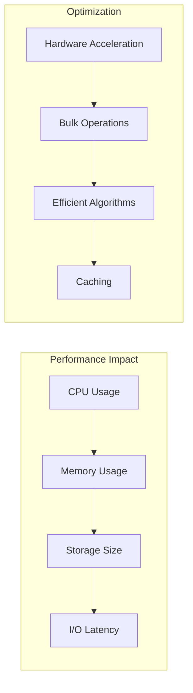

# Encryption

Wombat supports data-at-rest encryption to protect sensitive data stored in the database. This document covers encryption implementation, configuration, and security considerations.

## Encryption Architecture



## Supported Algorithms

### AES-256-GCM (Implemented)
- **Key Size**: 256 bits
- **Block Mode**: Galois/Counter Mode
- **Authentication**: Built-in AEAD
- **Performance**: Hardware accelerated on modern CPUs
- **Status**: Implemented

### ChaCha20-Poly1305 (Planned)
- **Key Size**: 256 bits
- **Stream Cipher**: ChaCha20
- **Authentication**: Poly1305 MAC
- **Performance**: Software optimized
- **Status**: Not yet implemented

## Configuration

### Basic Encryption Setup

```zig
const wombat = @import("wombat");

// Enable encryption with default settings
const options = wombat.Options.default("/path/to/db")
    .withEncryption(true, "your-32-byte-encryption-key-here");

// Custom encryption configuration
const enc_config = wombat.EncryptionConfig{
    .enable_encryption = true,
    .encryption_key = "your-32-byte-encryption-key-here",
    .cipher_mode = .aes_gcm,
    .key_rotation_interval_days = 30,
    .compress_before_encrypt = true,
};

const options = wombat.Options.default("/path/to/db")
    .withEncryptionConfig(enc_config);
```

### Key Management

```zig
pub const KeyManager = struct {
    master_key: [32]u8,
    data_keys: std.HashMap(u32, [32]u8),
    current_key_id: u32,
    
    pub fn init(master_key: [32]u8) KeyManager {
        return KeyManager{
            .master_key = master_key,
            .data_keys = std.HashMap(u32, [32]u8).init(allocator),
            .current_key_id = 0,
        };
    }
    
    pub fn generateDataKey(self: *KeyManager) ![32]u8 {
        var key: [32]u8 = undefined;
        std.crypto.random.bytes(&key);
        
        self.current_key_id += 1;
        try self.data_keys.put(self.current_key_id, key);
        
        return key;
    }
    
    pub fn rotateKeys(self: *KeyManager) !void {
        const old_key_id = self.current_key_id;
        _ = try self.generateDataKey();
        
        std.log.info("Rotated encryption key from {} to {}", .{old_key_id, self.current_key_id});
    }
};
```

## Implementation Details

### Encryption Interface

```zig
pub const Encryptor = struct {
    cipher: CipherType,
    key: [32]u8,
    
    pub const CipherType = enum {
        aes_gcm,
        chacha20_poly1305,
    };
    
    pub fn encrypt(self: *Encryptor, plaintext: []const u8, output: []u8) !usize {
        return switch (self.cipher) {
            .aes_gcm => self.encryptAESGCM(plaintext, output),
            .chacha20_poly1305 => self.encryptChaCha20(plaintext, output),
        };
    }
    
    pub fn decrypt(self: *Encryptor, ciphertext: []const u8, output: []u8) !usize {
        return switch (self.cipher) {
            .aes_gcm => self.decryptAESGCM(ciphertext, output),
            .chacha20_poly1305 => self.decryptChaCha20(ciphertext, output),
        };
    }
    
    fn encryptAESGCM(self: *Encryptor, plaintext: []const u8, output: []u8) !usize {
        // Generate random nonce
        var nonce: [12]u8 = undefined;
        std.crypto.random.bytes(&nonce);
        
        // Encrypt with AES-GCM
        const tag_len = 16;
        const ciphertext_len = plaintext.len;
        const total_len = 12 + ciphertext_len + tag_len; // nonce + ciphertext + tag
        
        if (output.len < total_len) return error.InsufficientSpace;
        
        // Copy nonce to output
        @memcpy(output[0..12], &nonce);
        
        // Encrypt data
        var tag: [16]u8 = undefined;
        std.crypto.aead.AesGcm.encrypt(
            output[12..12+ciphertext_len],
            &tag,
            plaintext,
            "",
            nonce,
            self.key
        );
        
        // Copy tag to output
        @memcpy(output[12+ciphertext_len..12+ciphertext_len+16], &tag);
        
        return total_len;
    }
    
    fn decryptAESGCM(self: *Encryptor, ciphertext: []const u8, output: []u8) !usize {
        if (ciphertext.len < 28) return error.InvalidCiphertext; // min: 12 + 0 + 16
        
        const nonce = ciphertext[0..12];
        const encrypted_data = ciphertext[12..ciphertext.len-16];
        const tag = ciphertext[ciphertext.len-16..ciphertext.len];
        
        if (output.len < encrypted_data.len) return error.InsufficientSpace;
        
        try std.crypto.aead.AesGcm.decrypt(
            output[0..encrypted_data.len],
            encrypted_data,
            tag.*,
            "",
            nonce.*,
            self.key
        );
        
        return encrypted_data.len;
    }
};
```

### Block-Level Encryption



### Encrypted Block Format

```zig
pub const EncryptedBlock = struct {
    header: EncryptionHeader,
    ciphertext: []u8,
    
    pub const EncryptionHeader = struct {
        algorithm: u8,
        key_id: u32,
        nonce_len: u8,
        metadata_len: u16,
        
        pub fn encode(self: EncryptionHeader, buffer: []u8) void {
            buffer[0] = self.algorithm;
            std.mem.writeIntLittle(u32, buffer[1..5], self.key_id);
            buffer[5] = self.nonce_len;
            std.mem.writeIntLittle(u16, buffer[6..8], self.metadata_len);
        }
        
        pub fn decode(buffer: []const u8) EncryptionHeader {
            return EncryptionHeader{
                .algorithm = buffer[0],
                .key_id = std.mem.readIntLittle(u32, buffer[1..5]),
                .nonce_len = buffer[5],
                .metadata_len = std.mem.readIntLittle(u16, buffer[6..8]),
            };
        }
    };
    
    pub fn decrypt(self: EncryptedBlock, key: [32]u8, output: []u8) !usize {
        const algorithm = @enumFromInt(self.header.algorithm);
        var encryptor = Encryptor{
            .cipher = algorithm,
            .key = key,
        };
        
        return encryptor.decrypt(self.ciphertext, output);
    }
};
```

## Value Log Encryption

### Encrypted Value Log Entry

```zig
pub const EncryptedVLogEntry = struct {
    header: VLogHeader,
    encrypted_data: []u8,
    
    pub const VLogHeader = struct {
        crc32: u32,
        timestamp: u64,
        key_len: u32,
        value_len: u32,
        encryption_info: EncryptionInfo,
    };
    
    pub const EncryptionInfo = struct {
        algorithm: u8,
        key_id: u32,
        nonce: [12]u8,
    };
    
    pub fn encryptEntry(key: []const u8, value: []const u8, encryptor: *Encryptor) !EncryptedVLogEntry {
        // Create combined data (key + value)
        const combined_len = key.len + value.len;
        const combined_data = try allocator.alloc(u8, combined_len);
        defer allocator.free(combined_data);
        
        @memcpy(combined_data[0..key.len], key);
        @memcpy(combined_data[key.len..], value);
        
        // Encrypt combined data
        const encrypted_buffer = try allocator.alloc(u8, combined_len + 28); // extra space for encryption overhead
        defer allocator.free(encrypted_buffer);
        
        const encrypted_len = try encryptor.encrypt(combined_data, encrypted_buffer);
        
        return EncryptedVLogEntry{
            .header = VLogHeader{
                .crc32 = 0, // Calculate after encryption
                .timestamp = std.time.milliTimestamp(),
                .key_len = @intCast(key.len),
                .value_len = @intCast(value.len),
                .encryption_info = EncryptionInfo{
                    .algorithm = @intFromEnum(encryptor.cipher),
                    .key_id = encryptor.key_id,
                    .nonce = encryptor.last_nonce,
                },
            },
            .encrypted_data = try allocator.dupe(u8, encrypted_buffer[0..encrypted_len]),
        };
    }
};
```

## Key Rotation

### Key Rotation Process



### Key Rotation Implementation

```zig
pub const KeyRotator = struct {
    key_manager: *KeyManager,
    db: *DB,
    
    pub fn rotateKeys(self: *KeyRotator) !void {
        std.log.info("Starting key rotation...");
        
        // Generate new key
        const new_key = try self.key_manager.generateDataKey();
        
        // Update configuration to use new key for writes
        self.db.encryption_config.encryption_key = new_key;
        
        // Start background migration
        try self.startMigration();
        
        std.log.info("Key rotation initiated");
    }
    
    fn startMigration(self: *KeyRotator) !void {
        // Identify blocks encrypted with old keys
        const old_blocks = try self.findOldBlocks();
        
        // Migrate blocks in batches
        for (old_blocks) |block_id| {
            try self.migrateBlock(block_id);
        }
        
        // Clean up old keys after migration
        try self.cleanupOldKeys();
    }
    
    fn migrateBlock(self: *KeyRotator, block_id: u32) !void {
        // Read block with old key
        const old_data = try self.readEncryptedBlock(block_id, self.key_manager.getPreviousKey());
        
        // Re-encrypt with new key
        const new_data = try self.encryptBlock(old_data, self.key_manager.getCurrentKey());
        
        // Write back to storage
        try self.writeEncryptedBlock(block_id, new_data);
        
        std.log.debug("Migrated block {}", .{block_id});
    }
};
```

## Security Considerations

### Key Security



### Security Best Practices

1. **Strong Key Generation**: Use cryptographically secure random number generators
2. **Key Storage**: Never store keys in plaintext
3. **Memory Protection**: Clear sensitive data from memory after use
4. **Access Control**: Limit key access to authorized processes
5. **Key Rotation**: Regularly rotate encryption keys
6. **Audit Logging**: Log all key operations

### Secure Key Handling

```zig
pub const SecureKey = struct {
    key: [32]u8,
    
    pub fn init(key_data: []const u8) !SecureKey {
        if (key_data.len != 32) return error.InvalidKeySize;
        
        var secure_key = SecureKey{ .key = undefined };
        @memcpy(&secure_key.key, key_data);
        
        return secure_key;
    }
    
    pub fn deinit(self: *SecureKey) void {
        // Clear key from memory
        std.crypto.utils.secureZero(u8, &self.key);
    }
    
    pub fn derive(self: SecureKey, salt: []const u8, output: []u8) !void {
        // Use PBKDF2 for key derivation
        try std.crypto.pwhash.pbkdf2(
            output,
            self.key,
            salt,
            100000, // iterations
            std.crypto.hash.sha2.Sha256
        );
    }
};
```

## Performance Impact

### Encryption Overhead



### Benchmarking Encryption

```zig
pub fn benchmarkEncryption(allocator: std.mem.Allocator) !void {
    const data_sizes = [_]usize{ 1024, 4096, 16384, 65536 };
    
    for (data_sizes) |size| {
        const plaintext = try allocator.alloc(u8, size);
        defer allocator.free(plaintext);
        
        const ciphertext = try allocator.alloc(u8, size + 28);
        defer allocator.free(ciphertext);
        
        std.crypto.random.bytes(plaintext);
        
        var encryptor = Encryptor{
            .cipher = .aes_gcm,
            .key = [_]u8{0} ** 32,
        };
        
        const start = std.time.nanoTimestamp();
        
        for (0..1000) |_| {
            _ = try encryptor.encrypt(plaintext, ciphertext);
        }
        
        const end = std.time.nanoTimestamp();
        const duration = end - start;
        const throughput = (@as(f64, @floatFromInt(size)) * 1000.0 * 1e9) / @as(f64, @floatFromInt(duration));
        
        std.log.info("Size: {} bytes, Throughput: {d:.2} MB/s", .{size, throughput / 1024 / 1024});
    }
}
```

This comprehensive encryption system provides strong data protection while maintaining reasonable performance characteristics for database operations.