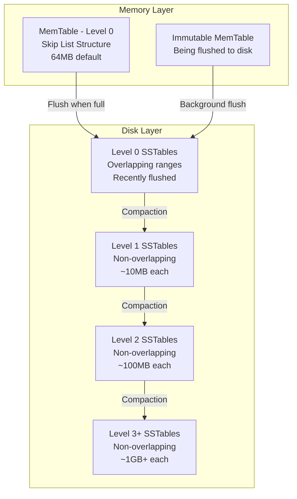
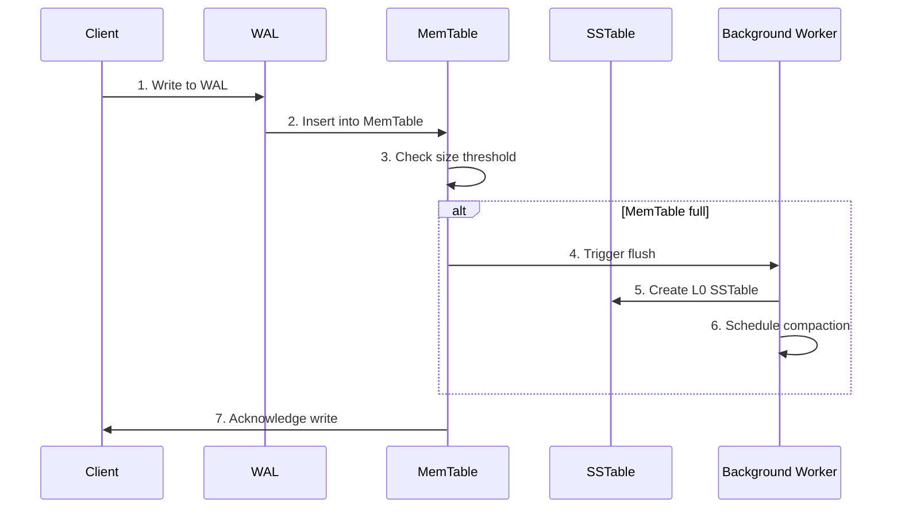
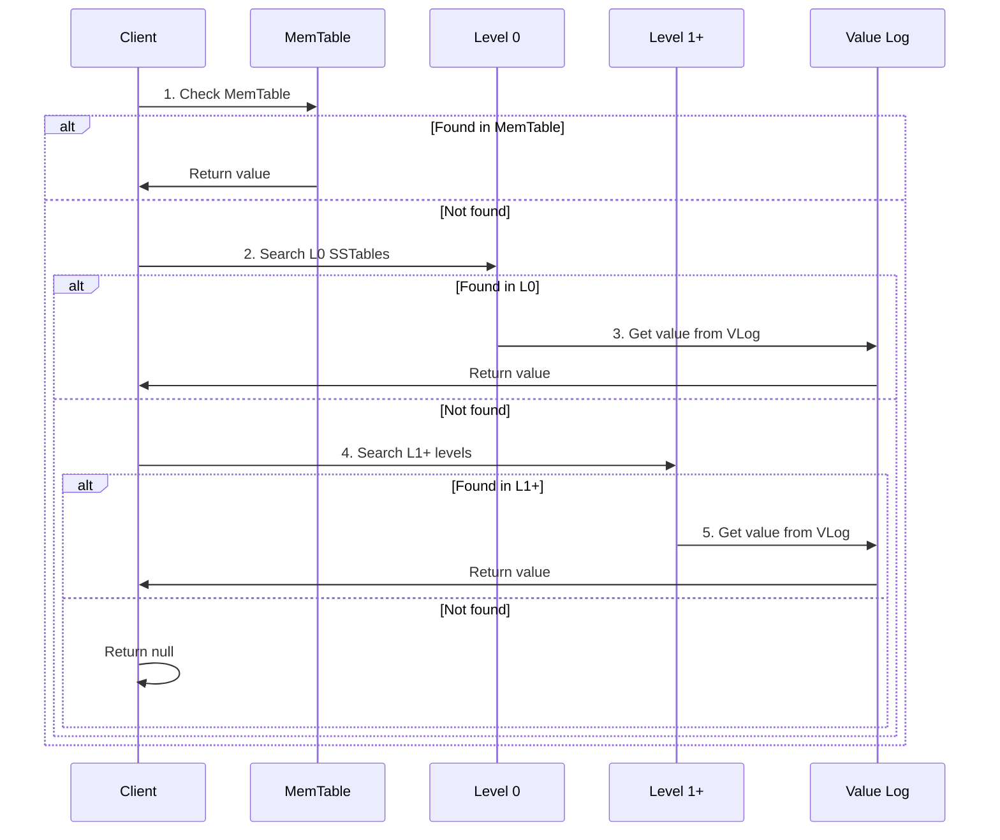
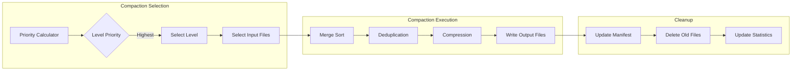
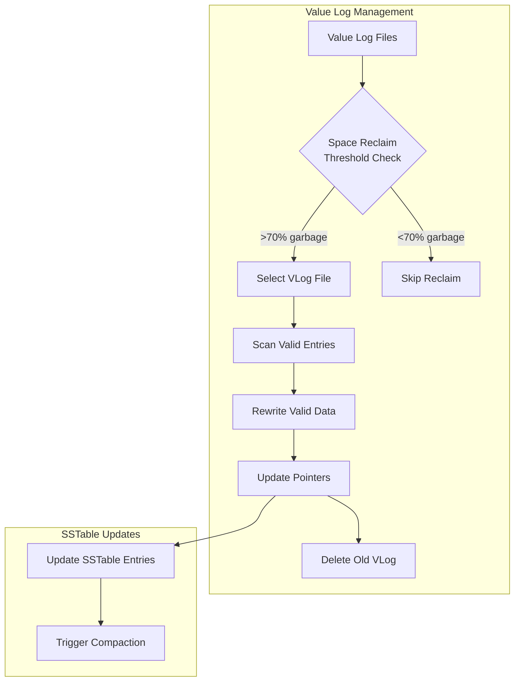
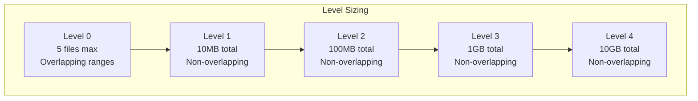
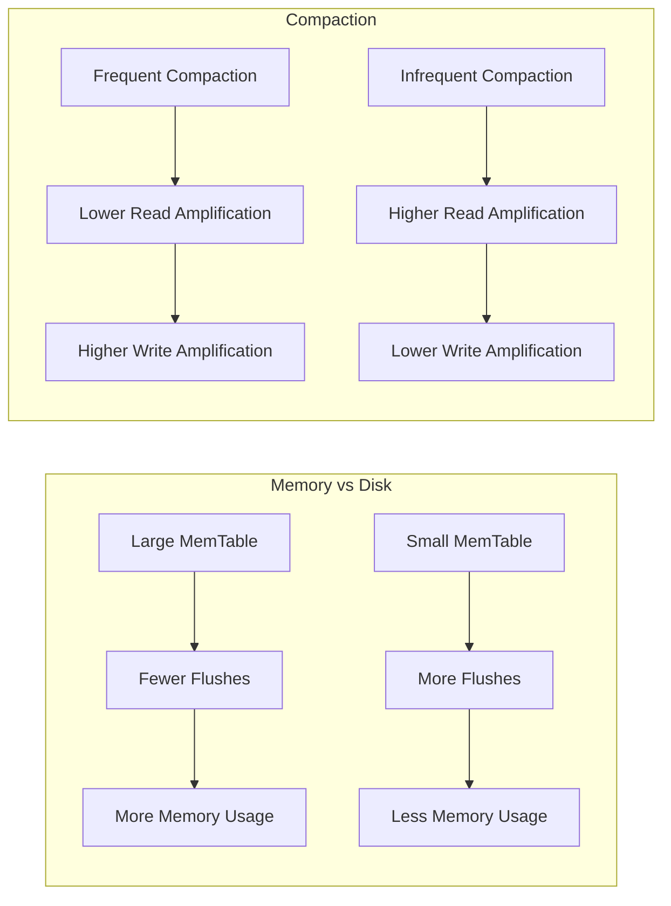
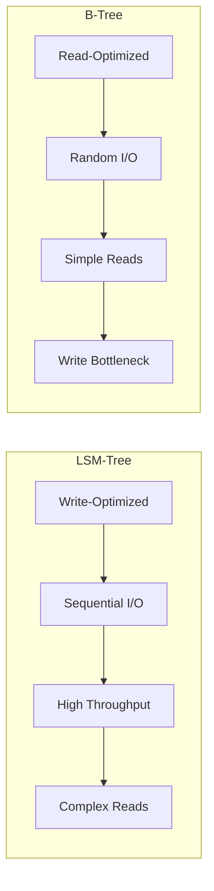

# LSM-Tree Fundamentals

This document explains the Log-Structured Merge-Tree (LSM-Tree) data structure that forms the core of Wombat's storage engine.

## What is an LSM-Tree?

An LSM-Tree is a data structure optimized for write-heavy workloads. It maintains data in multiple levels, with newer data in memory and older data in sorted files on disk.

## LSM-Tree Structure

## Write Path

## Read Path

## Compaction Process

## Space Reclaim Process

## Level Structure

## Key Properties

### Write Performance
- **Sequential Writes**: All writes go to WAL and MemTable
- **Batch Optimization**: Multiple writes batched together
- **Minimal Disk I/O**: Only background compaction touches disk

### Read Performance
- **Memory First**: Hot data served from MemTable
- **Bloom Filters**: Avoid unnecessary disk reads
- **Level Ordering**: Search from newest to oldest

### Space Efficiency
- **Compression**: Data compressed at each level
- **Deduplication**: Compaction removes duplicate keys
- **Space Reclaim**: Background garbage collection

## Configuration Trade-offs

## Performance Characteristics

### Write Amplification
- **Definition**: Total data written vs. user data written
- **LSM Factor**: Each level multiplies by level size factor
- **Optimization**: Larger levels, better compression

### Read Amplification
- **Definition**: Data read vs. user data returned
- **LSM Factor**: May need to check multiple levels
- **Optimization**: Bloom filters, caching

### Space Amplification
- **Definition**: Total space used vs. logical data size
- **LSM Factor**: Multiple copies during compaction
- **Optimization**: Efficient compaction, compression

## Comparison with B-Trees

## Best Practices

### When to Use LSM-Trees
- **Write-heavy workloads**
- **Time-series data**
- **Log aggregation**
- **Analytics workloads**

### When to Avoid LSM-Trees
- **Read-heavy workloads**
- **Point queries only**
- **Small datasets**
- **Memory-constrained environments**

This LSM-Tree implementation in Wombat provides a solid foundation for high-performance, write-optimized storage with configurable trade-offs between memory usage, write amplification, and read performance.