# Monitoring and Metrics

Wombat provides basic monitoring capabilities through internal statistics and configurable logging. This document covers the available monitoring features and how to extend them for production use.

**Note**: Advanced metrics export (Prometheus, Grafana) and health check endpoints are not yet implemented but can be built on top of the existing statistics framework.

## Available Monitoring Features

```mermaid
graph TB
    subgraph "Implemented Monitoring"
        A[Database Statistics] --> B[Operation Counters]
        B --> C[Memory Usage]
        C --> D[Storage Metrics]
        D --> E[Transaction Stats]
        E --> F[Error Tracking]
    end
    
    subgraph "Configuration Options"
        G[Log Level] --> H[Metrics Interval]
        H --> I[Error History]
        I --> J[Slow Query Log]
    end
    
    subgraph "Future Enhancements"
        K[Prometheus Export] --> L[Health Endpoints]
        L --> M[Real-time Alerts]
    end
```



## Database Statistics

Wombat provides built-in statistics through the `DBStats` structure:

```zig
// From actual implementation in db.zig
pub const DBStats = struct {
    memtable_size: usize,
    immutable_count: u32,
    level_sizes: [7]u64,
    gets_total: u64,
    puts_total: u64,
    deletes_total: u64,
    txn_commits: u64,
    txn_aborts: u64,
    compactions_total: u64,
    vlog_size: u64,
    vlog_space_reclaim_runs: u64,
};

// Usage example
const stats = db.getStats();
std.log.info("MemTable size: {} bytes", .{stats.memtable_size});
std.log.info("Total gets: {}", .{stats.gets_total});
std.log.info("Total puts: {}", .{stats.puts_total});
std.log.info("Transaction commits: {}", .{stats.txn_commits});
std.log.info("Transaction aborts: {}", .{stats.txn_aborts});
```

## Worker Statistics

Background worker performance is tracked through `WorkerStats`:

```zig
// From actual implementation in db.zig
pub const WorkerStats = struct {
    compaction_jobs_queued: atomic.Value(u64),
    compaction_jobs_completed: atomic.Value(u64),
    compaction_jobs_failed: atomic.Value(u64),
    compaction_bytes_processed: atomic.Value(u64),
    compaction_duration_ms: atomic.Value(u64),
    writer_batches_processed: atomic.Value(u64),
    writer_queue_depth: atomic.Value(u32),
    vlog_space_reclaimed_bytes: atomic.Value(u64),
    active_compaction_workers: atomic.Value(u32),
    
    // Methods available:
    pub fn recordCompactionJob(self: *Self, bytes_processed: u64, duration_ms: u64) void
    pub fn recordFailedCompaction(self: *Self) void
    pub fn setWorkerQueueDepth(self: *Self, depth: u32) void
};
```

## Error Tracking

Comprehensive error tracking and metrics:

```zig
// Available error metrics from the actual implementation
pub const ErrorMetrics = struct {
    // Error categorization and tracking
    db_errors: HashMap(DBError, u64),
    vlog_errors: HashMap(VLogError, u64),
    txn_errors: HashMap(TxnError, u64),
    table_errors: HashMap(TableError, u64),
    compaction_errors: HashMap(CompactionError, u64),
    
    // Error rate calculation
    pub fn getErrorRate(self: *const Self, window_ms: u64) f64
    pub fn isErrorRateHigh(self: *const Self, threshold: f64, window_ms: u64) bool
    pub fn getErrorCount(self: *const Self, comptime ErrorType: type, error_value: ErrorType) u64
};

// Usage
const error_metrics = db.getErrorMetrics();
const error_rate = error_metrics.getErrorRate(60000); // Last minute
if (error_rate > 0.01) { // 1% error rate
    std.log.warn("High error rate detected: {d:.2}%", .{error_rate * 100});
}
```

## Configuration

### Monitoring Configuration

```zig
// From actual Options implementation
pub const MonitoringConfig = struct {
    enable_metrics: bool = true,
    metrics_interval_ms: u32 = 10000,
    max_error_history: u32 = 1000,
    log_level: LogLevel = .info,
    enable_slow_query_log: bool = true,
    slow_query_threshold_ms: u32 = 1000,
    enable_operation_tracing: bool = false,
};

// Usage
const options = wombat.Options.default("/path/to/db")
    .withMonitoringConfig(.{
        .enable_metrics = true,
        .log_level = .info,
        .slow_query_threshold_ms = 500,
    });
```

### Log Levels

```zig
pub const LogLevel = enum {
    debug,
    info,
    warn,
    err,
};
```

## Basic Monitoring Implementation

### Periodic Statistics Logging

```zig
// Example monitoring implementation
pub fn monitorDatabase(db: *wombat.DB) void {
    const stats = db.getStats();
    
    std.log.info("=== Database Statistics ===");
    std.log.info("MemTable size: {} MB", .{stats.memtable_size / (1024 * 1024)});
    std.log.info("Operations - Gets: {}, Puts: {}, Deletes: {}", 
                 .{stats.gets_total, stats.puts_total, stats.deletes_total});
    std.log.info("Transactions - Commits: {}, Aborts: {}", 
                 .{stats.txn_commits, stats.txn_aborts});
    std.log.info("Compactions: {}", .{stats.compactions_total});
    std.log.info("Value Log size: {} MB", .{stats.vlog_size / (1024 * 1024)});
    
    // Level sizes
    for (stats.level_sizes, 0..) |size, level| {
        if (size > 0) {
            std.log.info("Level {}: {} MB", .{level, size / (1024 * 1024)});
        }
    }
}
```

### Error Rate Monitoring

```zig
pub fn checkErrorRates(db: *wombat.DB) void {
    const error_metrics = db.getErrorMetrics();
    const error_rate = error_metrics.getErrorRate(60000); // Last minute
    
    if (error_rate > 0.01) { // 1% threshold
        std.log.warn("High error rate: {d:.2}%", .{error_rate * 100});
    }
    
    // Check specific error types
    const txn_conflict_count = error_metrics.getErrorCount(wombat.TxnError, wombat.TxnError.TransactionConflict);
    if (txn_conflict_count > 100) {
        std.log.warn("High transaction conflict rate: {}", .{txn_conflict_count});
    }
}
```

## Extending Monitoring

### Custom Metrics Collection

```zig
// Example custom metrics wrapper
pub const CustomMetrics = struct {
    db: *wombat.DB,
    start_time: i64,
    operation_histogram: HashMap([]const u8, ArrayList(u64)),
    
    pub fn init(db: *wombat.DB, allocator: std.mem.Allocator) CustomMetrics {
        return CustomMetrics{
            .db = db,
            .start_time = std.time.milliTimestamp(),
            .operation_histogram = HashMap([]const u8, ArrayList(u64)).init(allocator),
        };
    }
    
    pub fn recordOperation(self: *CustomMetrics, operation: []const u8, duration_ms: u64) !void {
        const entry = self.operation_histogram.getOrPut(operation) catch return;
        if (!entry.found_existing) {
            entry.value_ptr.* = ArrayList(u64).init(self.allocator);
        }
        try entry.value_ptr.append(duration_ms);
    }
    
    pub fn getPercentile(self: *CustomMetrics, operation: []const u8, percentile: f64) ?u64 {
        const durations = self.operation_histogram.get(operation) orelse return null;
        if (durations.items.len == 0) return null;
        
        // Sort and calculate percentile
        std.sort.sort(u64, durations.items, {}, std.sort.asc(u64));
        const index = @as(usize, @intFromFloat(@as(f64, @floatFromInt(durations.items.len)) * percentile));
        return durations.items[@min(index, durations.items.len - 1)];
    }
};
```

### Prometheus Integration (Example)

```zig
// Example integration with external metrics system
pub const PrometheusExporter = struct {
    db: *wombat.DB,
    
    pub fn exportMetrics(self: *PrometheusExporter, writer: anytype) !void {
        const stats = self.db.getStats();
        
        // Export basic metrics
        try writer.print("# HELP wombat_operations_total Total database operations\n");
        try writer.print("# TYPE wombat_operations_total counter\n");
        try writer.print("wombat_operations_total{{operation=\"get\"}} {}\n", .{stats.gets_total});
        try writer.print("wombat_operations_total{{operation=\"put\"}} {}\n", .{stats.puts_total});
        try writer.print("wombat_operations_total{{operation=\"delete\"}} {}\n", .{stats.deletes_total});
        
        try writer.print("# HELP wombat_memtable_size_bytes MemTable size in bytes\n");
        try writer.print("# TYPE wombat_memtable_size_bytes gauge\n");
        try writer.print("wombat_memtable_size_bytes {}\n", .{stats.memtable_size});
        
        try writer.print("# HELP wombat_transactions_total Total transactions\n");
        try writer.print("# TYPE wombat_transactions_total counter\n");
        try writer.print("wombat_transactions_total{{result=\"commit\"}} {}\n", .{stats.txn_commits});
        try writer.print("wombat_transactions_total{{result=\"abort\"}} {}\n", .{stats.txn_aborts});
    }
};
```

## Logging

### Structured Logging

```zig
// Example structured logging implementation
pub fn logStructured(
    level: wombat.LogLevel,
    operation: []const u8,
    key: ?[]const u8,
    duration_us: ?u64,
    error_msg: ?[]const u8,
) void {
    const timestamp = std.time.milliTimestamp();
    
    var buffer: [1024]u8 = undefined;
    var stream = std.io.fixedBufferStream(&buffer);
    var writer = stream.writer();
    
    writer.print("{{\"timestamp\":{},\"level\":\"{s}\",\"operation\":\"{s}\"", 
                 .{timestamp, @tagName(level), operation}) catch return;
    
    if (key) |k| {
        writer.print(",\"key\":\"{s}\"", .{k}) catch return;
    }
    
    if (duration_us) |d| {
        writer.print(",\"duration_us\":{}", .{d}) catch return;
    }
    
    if (error_msg) |err| {
        writer.print(",\"error\":\"{s}\"", .{err}) catch return;
    }
    
    writer.print("}}\n", .{}) catch return;
    
    std.log.info("{s}", .{stream.getWritten()});
}
```

## Best Practices

### Monitoring Recommendations

1. **Regular Statistics Collection**: Poll `getStats()` periodically
2. **Error Rate Monitoring**: Track error rates and set thresholds
3. **Performance Tracking**: Monitor operation latencies
4. **Resource Usage**: Watch MemTable and disk usage
5. **Transaction Health**: Monitor commit/abort ratios

### Performance Considerations

- Monitoring overhead is minimal as statistics are maintained internally
- Avoid excessive logging in hot paths
- Use atomic operations for thread-safe metrics
- Consider sampling for high-frequency operations

### Future Enhancements

The monitoring framework is designed to be extensible. Planned features include:

- HTTP metrics endpoint
- Prometheus integration
- Real-time alerting
- Dashboard integration
- Historical data storage

This monitoring foundation provides the necessary observability for production deployments while maintaining simplicity and performance.