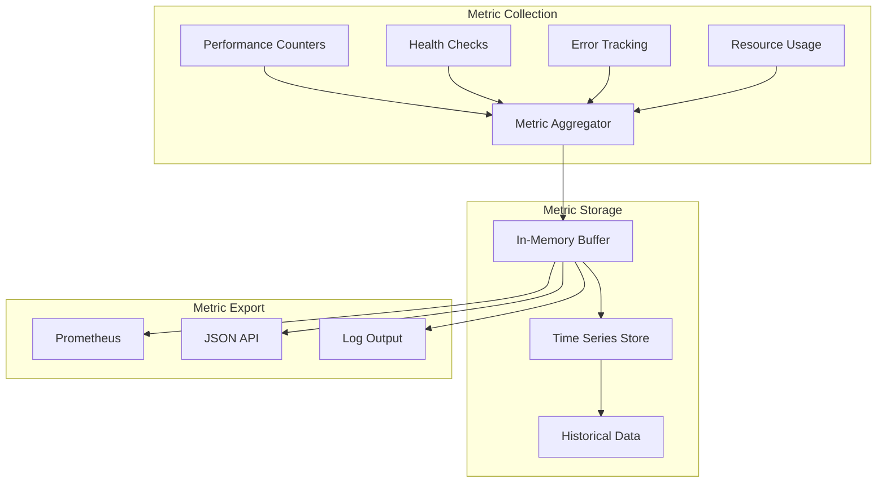
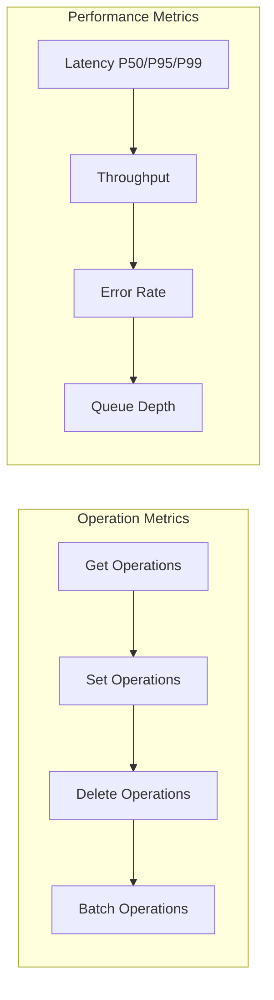
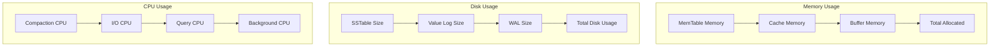
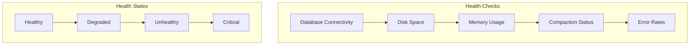
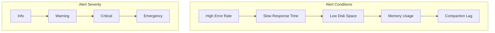
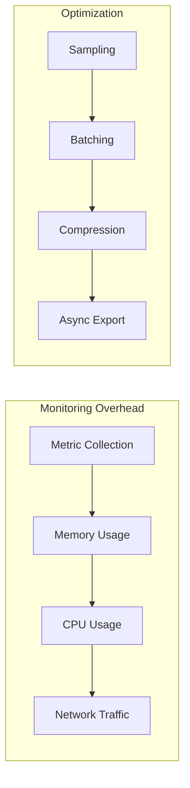

# Monitoring and Metrics

Wombat provides comprehensive monitoring capabilities to track performance, health, and operational metrics. This document covers the monitoring system, available metrics, and best practices for observability.

## Monitoring Architecture



## Core Metrics

### Database Operations



### System Resources



## Metrics Implementation

### Metric Types

```zig
pub const MetricType = enum {
    counter,
    gauge,
    histogram,
    summary,
};

pub const Metric = struct {
    name: []const u8,
    type: MetricType,
    value: MetricValue,
    labels: std.StringHashMap([]const u8),
    timestamp: i64,
    
    pub const MetricValue = union(MetricType) {
        counter: u64,
        gauge: f64,
        histogram: HistogramValue,
        summary: SummaryValue,
    };
    
    pub const HistogramValue = struct {
        buckets: []HistogramBucket,
        sum: f64,
        count: u64,
    };
    
    pub const SummaryValue = struct {
        quantiles: []Quantile,
        sum: f64,
        count: u64,
    };
};
```

### Metrics Registry

```zig
pub const MetricsRegistry = struct {
    metrics: std.StringHashMap(Metric),
    mutex: std.Thread.Mutex,
    enabled: bool,
    
    pub fn init(allocator: std.mem.Allocator) MetricsRegistry {
        return MetricsRegistry{
            .metrics = std.StringHashMap(Metric).init(allocator),
            .mutex = std.Thread.Mutex{},
            .enabled = true,
        };
    }
    
    pub fn incrementCounter(self: *MetricsRegistry, name: []const u8, value: u64) void {
        if (!self.enabled) return;
        
        self.mutex.lock();
        defer self.mutex.unlock();
        
        if (self.metrics.getPtr(name)) |metric| {
            metric.value.counter += value;
        } else {
            const metric = Metric{
                .name = name,
                .type = .counter,
                .value = .{ .counter = value },
                .labels = std.StringHashMap([]const u8).init(self.allocator),
                .timestamp = std.time.milliTimestamp(),
            };
            self.metrics.put(name, metric) catch {};
        }
    }
    
    pub fn setGauge(self: *MetricsRegistry, name: []const u8, value: f64) void {
        if (!self.enabled) return;
        
        self.mutex.lock();
        defer self.mutex.unlock();
        
        const metric = Metric{
            .name = name,
            .type = .gauge,
            .value = .{ .gauge = value },
            .labels = std.StringHashMap([]const u8).init(self.allocator),
            .timestamp = std.time.milliTimestamp(),
        };
        self.metrics.put(name, metric) catch {};
    }
    
    pub fn recordHistogram(self: *MetricsRegistry, name: []const u8, value: f64) void {
        if (!self.enabled) return;
        
        self.mutex.lock();
        defer self.mutex.unlock();
        
        if (self.metrics.getPtr(name)) |metric| {
            self.updateHistogram(&metric.value.histogram, value);
        } else {
            const histogram = self.createHistogram(value);
            const metric = Metric{
                .name = name,
                .type = .histogram,
                .value = .{ .histogram = histogram },
                .labels = std.StringHashMap([]const u8).init(self.allocator),
                .timestamp = std.time.milliTimestamp(),
            };
            self.metrics.put(name, metric) catch {};
        }
    }
};
```

## Database Metrics

### Performance Metrics

```zig
pub const DatabaseMetrics = struct {
    registry: *MetricsRegistry,
    
    // Operation counters
    get_operations: []const u8 = "db_get_operations_total",
    set_operations: []const u8 = "db_set_operations_total",
    delete_operations: []const u8 = "db_delete_operations_total",
    
    // Latency histograms
    get_latency: []const u8 = "db_get_latency_seconds",
    set_latency: []const u8 = "db_set_latency_seconds",
    delete_latency: []const u8 = "db_delete_latency_seconds",
    
    // Error counters
    get_errors: []const u8 = "db_get_errors_total",
    set_errors: []const u8 = "db_set_errors_total",
    delete_errors: []const u8 = "db_delete_errors_total",
    
    pub fn recordGet(self: *DatabaseMetrics, duration_ns: u64, success: bool) void {
        self.registry.incrementCounter(self.get_operations, 1);
        self.registry.recordHistogram(self.get_latency, @as(f64, @floatFromInt(duration_ns)) / 1e9);
        
        if (!success) {
            self.registry.incrementCounter(self.get_errors, 1);
        }
    }
    
    pub fn recordSet(self: *DatabaseMetrics, duration_ns: u64, success: bool) void {
        self.registry.incrementCounter(self.set_operations, 1);
        self.registry.recordHistogram(self.set_latency, @as(f64, @floatFromInt(duration_ns)) / 1e9);
        
        if (!success) {
            self.registry.incrementCounter(self.set_errors, 1);
        }
    }
    
    pub fn updateMemoryUsage(self: *DatabaseMetrics, memtable_bytes: u64, cache_bytes: u64) void {
        self.registry.setGauge("db_memtable_bytes", @floatFromInt(memtable_bytes));
        self.registry.setGauge("db_cache_bytes", @floatFromInt(cache_bytes));
        self.registry.setGauge("db_total_memory_bytes", @floatFromInt(memtable_bytes + cache_bytes));
    }
};
```

### Storage Metrics

```zig
pub const StorageMetrics = struct {
    registry: *MetricsRegistry,
    
    pub fn updateLevelStats(self: *StorageMetrics, level: u32, file_count: u32, total_size: u64) void {
        const level_str = std.fmt.allocPrint(self.allocator, "{}", .{level}) catch return;
        defer self.allocator.free(level_str);
        
        // Create metrics with level label
        var labels = std.StringHashMap([]const u8).init(self.allocator);
        defer labels.deinit();
        labels.put("level", level_str) catch return;
        
        self.registry.setGaugeWithLabels("db_level_files", @floatFromInt(file_count), labels);
        self.registry.setGaugeWithLabels("db_level_bytes", @floatFromInt(total_size), labels);
    }
    
    pub fn recordCompaction(self: *StorageMetrics, level: u32, input_files: u32, output_files: u32, 
                           input_bytes: u64, output_bytes: u64, duration_ms: u64) void {
        self.registry.incrementCounter("db_compaction_operations_total", 1);
        self.registry.recordHistogram("db_compaction_duration_seconds", @as(f64, @floatFromInt(duration_ms)) / 1000.0);
        
        const write_amp = @as(f64, @floatFromInt(output_bytes)) / @as(f64, @floatFromInt(input_bytes));
        self.registry.recordHistogram("db_compaction_write_amplification", write_amp);
        
        self.registry.incrementCounter("db_compaction_input_files_total", input_files);
        self.registry.incrementCounter("db_compaction_output_files_total", output_files);
        self.registry.incrementCounter("db_compaction_input_bytes_total", input_bytes);
        self.registry.incrementCounter("db_compaction_output_bytes_total", output_bytes);
    }
    
    pub fn recordSpaceReclaim(self: *StorageMetrics, reclaimed_bytes: u64, duration_ms: u64) void {
        self.registry.incrementCounter("db_space_reclaim_operations_total", 1);
        self.registry.incrementCounter("db_space_reclaim_bytes_total", reclaimed_bytes);
        self.registry.recordHistogram("db_space_reclaim_duration_seconds", @as(f64, @floatFromInt(duration_ms)) / 1000.0);
    }
};
```

## Health Checks

### Health Check System



### Health Check Implementation

```zig
pub const HealthStatus = enum {
    healthy,
    degraded,
    unhealthy,
    critical,
};

pub const HealthCheck = struct {
    name: []const u8,
    status: HealthStatus,
    message: []const u8,
    last_check: i64,
    
    pub fn isHealthy(self: HealthCheck) bool {
        return self.status == .healthy;
    }
};

pub const HealthMonitor = struct {
    checks: std.ArrayList(HealthCheck),
    db: *DB,
    
    pub fn runHealthChecks(self: *HealthMonitor) []HealthCheck {
        var results = std.ArrayList(HealthCheck).init(self.allocator);
        
        // Database connectivity
        results.append(self.checkDatabaseConnectivity()) catch {};
        
        // Disk space
        results.append(self.checkDiskSpace()) catch {};
        
        // Memory usage
        results.append(self.checkMemoryUsage()) catch {};
        
        // Compaction status
        results.append(self.checkCompactionStatus()) catch {};
        
        // Error rates
        results.append(self.checkErrorRates()) catch {};
        
        return results.toOwnedSlice();
    }
    
    fn checkDatabaseConnectivity(self: *HealthMonitor) HealthCheck {
        const test_key = "health_check_key";
        const test_value = "health_check_value";
        
        // Try basic operations
        self.db.set(test_key, test_value) catch {
            return HealthCheck{
                .name = "database_connectivity",
                .status = .critical,
                .message = "Cannot write to database",
                .last_check = std.time.milliTimestamp(),
            };
        };
        
        const retrieved = self.db.get(test_key) catch {
            return HealthCheck{
                .name = "database_connectivity",
                .status = .critical,
                .message = "Cannot read from database",
                .last_check = std.time.milliTimestamp(),
            };
        };
        
        defer if (retrieved) |value| self.db.allocator.free(value);
        
        if (retrieved == null or !std.mem.eql(u8, retrieved.?, test_value)) {
            return HealthCheck{
                .name = "database_connectivity",
                .status = .unhealthy,
                .message = "Data integrity issue",
                .last_check = std.time.milliTimestamp(),
            };
        }
        
        // Clean up
        self.db.delete(test_key) catch {};
        
        return HealthCheck{
            .name = "database_connectivity",
            .status = .healthy,
            .message = "Database is responsive",
            .last_check = std.time.milliTimestamp(),
        };
    }
    
    fn checkDiskSpace(self: *HealthMonitor) HealthCheck {
        const dir = std.fs.cwd().openDir(self.db.options.dir, .{}) catch {
            return HealthCheck{
                .name = "disk_space",
                .status = .critical,
                .message = "Cannot access database directory",
                .last_check = std.time.milliTimestamp(),
            };
        };
        defer dir.close();
        
        // Check available space (platform-specific implementation needed)
        const available_bytes = self.getAvailableDiskSpace() catch {
            return HealthCheck{
                .name = "disk_space",
                .status = .degraded,
                .message = "Cannot determine disk space",
                .last_check = std.time.milliTimestamp(),
            };
        };
        
        const min_required = 100 * 1024 * 1024; // 100MB minimum
        
        if (available_bytes < min_required) {
            return HealthCheck{
                .name = "disk_space",
                .status = .critical,
                .message = "Insufficient disk space",
                .last_check = std.time.milliTimestamp(),
            };
        } else if (available_bytes < min_required * 10) {
            return HealthCheck{
                .name = "disk_space",
                .status = .degraded,
                .message = "Low disk space",
                .last_check = std.time.milliTimestamp(),
            };
        }
        
        return HealthCheck{
            .name = "disk_space",
            .status = .healthy,
            .message = "Sufficient disk space available",
            .last_check = std.time.milliTimestamp(),
        };
    }
};
```

## Alerting System

### Alert Rules



### Alert Configuration

```zig
pub const AlertRule = struct {
    name: []const u8,
    condition: AlertCondition,
    severity: AlertSeverity,
    threshold: f64,
    duration: u64, // milliseconds
    
    pub const AlertCondition = enum {
        metric_above,
        metric_below,
        metric_absent,
        rate_above,
        rate_below,
    };
    
    pub const AlertSeverity = enum {
        info,
        warning,
        critical,
        emergency,
    };
};

pub const AlertManager = struct {
    rules: []AlertRule,
    active_alerts: std.ArrayList(ActiveAlert),
    
    pub const ActiveAlert = struct {
        rule: AlertRule,
        triggered_at: i64,
        value: f64,
        message: []const u8,
    };
    
    pub fn evaluateAlerts(self: *AlertManager, metrics: *MetricsRegistry) void {
        for (self.rules) |rule| {
            if (self.evaluateRule(rule, metrics)) {
                self.fireAlert(rule, metrics);
            }
        }
    }
    
    fn evaluateRule(self: *AlertManager, rule: AlertRule, metrics: *MetricsRegistry) bool {
        // Implementation depends on rule type
        return switch (rule.condition) {
            .metric_above => self.checkMetricAbove(rule, metrics),
            .metric_below => self.checkMetricBelow(rule, metrics),
            .metric_absent => self.checkMetricAbsent(rule, metrics),
            .rate_above => self.checkRateAbove(rule, metrics),
            .rate_below => self.checkRateBelow(rule, metrics),
        };
    }
    
    fn fireAlert(self: *AlertManager, rule: AlertRule, metrics: *MetricsRegistry) void {
        const alert = ActiveAlert{
            .rule = rule,
            .triggered_at = std.time.milliTimestamp(),
            .value = self.getMetricValue(rule.name, metrics),
            .message = self.formatAlertMessage(rule),
        };
        
        self.active_alerts.append(alert) catch {};
        
        // Send notification (webhook, email, etc.)
        self.sendNotification(alert);
    }
};
```

## Monitoring Configuration

### Configuration Options

```zig
pub const MonitoringConfig = struct {
    enable_metrics: bool = true,
    metrics_interval_ms: u32 = 10000,
    max_error_history: u32 = 1000,
    log_level: LogLevel = .info,
    enable_slow_query_log: bool = true,
    slow_query_threshold_ms: u32 = 1000,
    enable_operation_tracing: bool = false,
    
    // Health check settings
    health_check_interval_ms: u32 = 30000,
    health_check_timeout_ms: u32 = 5000,
    
    // Alert settings
    enable_alerts: bool = true,
    alert_evaluation_interval_ms: u32 = 60000,
    
    // Export settings
    prometheus_enabled: bool = false,
    prometheus_port: u16 = 9090,
    json_api_enabled: bool = true,
    json_api_port: u16 = 8080,
};
```

## Metric Export

### Prometheus Export

```zig
pub const PrometheusExporter = struct {
    registry: *MetricsRegistry,
    
    pub fn exportMetrics(self: *PrometheusExporter, writer: anytype) !void {
        const metrics = self.registry.getAllMetrics();
        
        for (metrics) |metric| {
            try self.writeMetric(writer, metric);
        }
    }
    
    fn writeMetric(self: *PrometheusExporter, writer: anytype, metric: Metric) !void {
        // Write metric help
        try writer.print("# HELP {} {}\n", .{metric.name, self.getMetricHelp(metric.name)});
        
        // Write metric type
        try writer.print("# TYPE {} {}\n", .{metric.name, @tagName(metric.type)});
        
        // Write metric value
        switch (metric.type) {
            .counter => {
                try writer.print("{} {}\n", .{metric.name, metric.value.counter});
            },
            .gauge => {
                try writer.print("{} {}\n", .{metric.name, metric.value.gauge});
            },
            .histogram => {
                try self.writeHistogram(writer, metric.name, metric.value.histogram);
            },
            .summary => {
                try self.writeSummary(writer, metric.name, metric.value.summary);
            },
        }
    }
};
```

### JSON API Export

```zig
pub const JSONExporter = struct {
    registry: *MetricsRegistry,
    
    pub fn exportMetrics(self: *JSONExporter, allocator: std.mem.Allocator) ![]u8 {
        var json_metrics = std.ArrayList(u8).init(allocator);
        var writer = json_metrics.writer();
        
        try writer.writeAll("{\"metrics\":[");
        
        const metrics = self.registry.getAllMetrics();
        for (metrics, 0..) |metric, i| {
            if (i > 0) try writer.writeAll(",");
            try self.writeMetricJSON(writer, metric);
        }
        
        try writer.writeAll("]}");
        return json_metrics.toOwnedSlice();
    }
    
    fn writeMetricJSON(self: *JSONExporter, writer: anytype, metric: Metric) !void {
        try writer.print("{{\"name\":\"{s}\",\"type\":\"{s}\",", .{metric.name, @tagName(metric.type)});
        
        switch (metric.type) {
            .counter => {
                try writer.print("\"value\":{}", .{metric.value.counter});
            },
            .gauge => {
                try writer.print("\"value\":{d}", .{metric.value.gauge});
            },
            .histogram => {
                try self.writeHistogramJSON(writer, metric.value.histogram);
            },
            .summary => {
                try self.writeSummaryJSON(writer, metric.value.summary);
            },
        }
        
        try writer.print(",\"timestamp\":{}}}", .{metric.timestamp});
    }
};
```

## Best Practices

### Monitoring Best Practices

1. **Monitor key metrics** - Focus on SLIs (Service Level Indicators)
2. **Set up alerts** - Proactive notification of issues
3. **Track trends** - Monitor long-term performance trends
4. **Correlate metrics** - Understand relationships between metrics
5. **Regular review** - Periodic review of monitoring effectiveness

### Performance Impact



This comprehensive monitoring system provides deep visibility into Wombat's performance and health, enabling proactive issue detection and performance optimization.