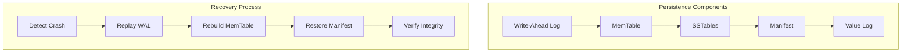
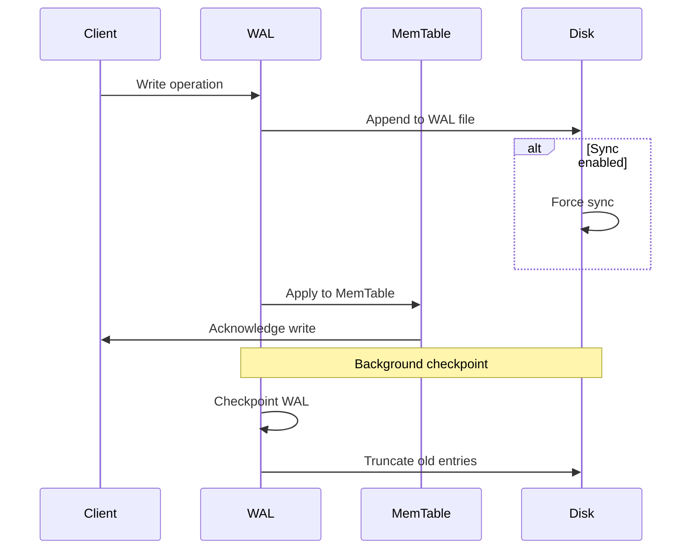
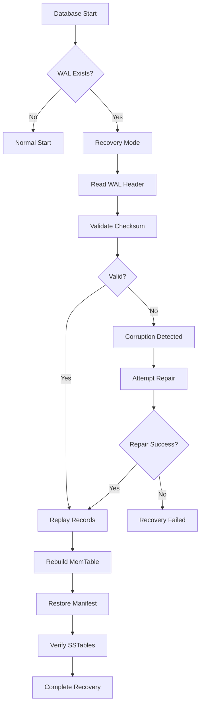
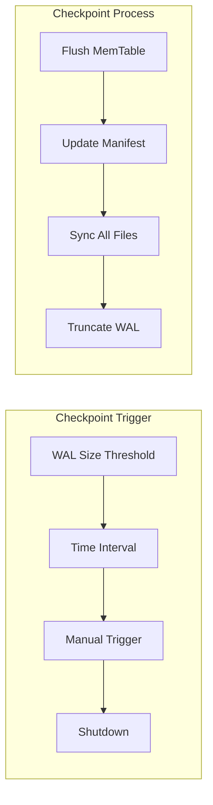
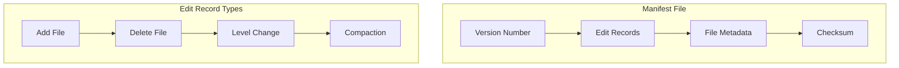
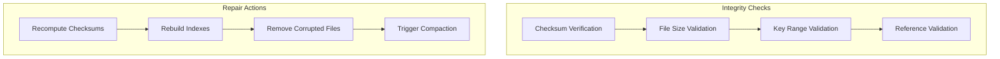
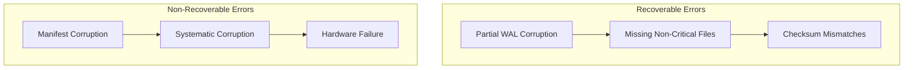
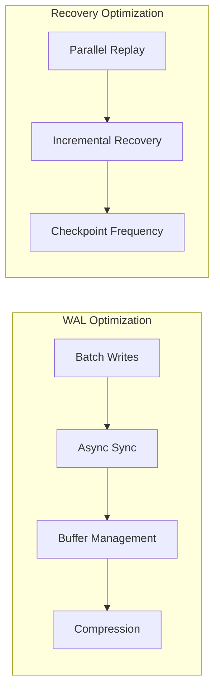

# Recovery and Persistence

Wombat provides robust crash recovery and persistence mechanisms to ensure data durability and consistency. This document covers the recovery system, WAL implementation, and crash recovery procedures.

## Recovery System Overview



## Write-Ahead Log (WAL)

The WAL ensures durability by recording all writes before they are applied to the MemTable.

### WAL Structure


### WAL Operations



### WAL Implementation

```zig
pub const WAL = struct {
    const LogRecord = struct {
        record_type: RecordType,
        timestamp: u64,
        key: []const u8,
        value: []const u8,
        crc: u32,
        
        pub fn encode(self: LogRecord, buffer: []u8) !usize {
            var offset: usize = 0;
            
            // Write record type
            buffer[offset] = @intFromEnum(self.record_type);
            offset += 1;
            
            // Write timestamp
            std.mem.writeIntLittle(u64, buffer[offset..offset+8], self.timestamp);
            offset += 8;
            
            // Write key length and data
            std.mem.writeIntLittle(u32, buffer[offset..offset+4], @intCast(self.key.len));
            offset += 4;
            @memcpy(buffer[offset..offset+self.key.len], self.key);
            offset += self.key.len;
            
            // Write value length and data
            std.mem.writeIntLittle(u32, buffer[offset..offset+4], @intCast(self.value.len));
            offset += 4;
            @memcpy(buffer[offset..offset+self.value.len], self.value);
            offset += self.value.len;
            
            // Calculate and write CRC
            const crc = std.hash.Crc32.hash(buffer[0..offset]);
            std.mem.writeIntLittle(u32, buffer[offset..offset+4], crc);
            offset += 4;
            
            return offset;
        }
    };
    
    file: std.fs.File,
    sync_writes: bool,
    buffer: []u8,
    offset: usize,
    
    pub fn append(self: *WAL, record: LogRecord) !void {
        const encoded_size = try record.encode(self.buffer[self.offset..]);
        self.offset += encoded_size;
        
        // Flush if buffer is full or sync is enabled
        if (self.offset >= self.buffer.len * 0.8 or self.sync_writes) {
            try self.flush();
        }
    }
    
    pub fn flush(self: *WAL) !void {
        if (self.offset > 0) {
            _ = try self.file.write(self.buffer[0..self.offset]);
            
            if (self.sync_writes) {
                try self.file.sync();
            }
            
            self.offset = 0;
        }
    }
};
```

## Crash Recovery Process

### Recovery Workflow



### Recovery Implementation

```zig
pub const RecoveryManager = struct {
    db: *DB,
    wal: *WAL,
    
    pub fn recover(self: *RecoveryManager) !void {
        std.log.info("Starting crash recovery...");
        
        // Phase 1: Replay WAL
        try self.replayWAL();
        
        // Phase 2: Restore manifest
        try self.restoreManifest();
        
        // Phase 3: Verify data integrity
        try self.verifyIntegrity();
        
        // Phase 4: Cleanup
        try self.cleanup();
        
        std.log.info("Crash recovery completed successfully");
    }
    
    fn replayWAL(self: *RecoveryManager) !void {
        const wal_file = std.fs.cwd().openFile("db.wal", .{}) catch |err| {
            if (err == error.FileNotFound) {
                std.log.info("No WAL file found, starting fresh");
                return;
            }
            return err;
        };
        defer wal_file.close();
        
        var reader = wal_file.reader();
        var records_replayed: u32 = 0;
        
        while (true) {
            const record = LogRecord.decode(reader) catch |err| {
                if (err == error.EndOfStream) break;
                std.log.warn("Corrupted WAL record, stopping replay");
                break;
            };
            
            // Apply record to MemTable
            try self.applyRecord(record);
            records_replayed += 1;
        }
        
        std.log.info("Replayed {} WAL records", .{records_replayed});
    }
    
    fn applyRecord(self: *RecoveryManager, record: LogRecord) !void {
        switch (record.record_type) {
            .put => {
                const value_struct = ValueStruct{
                    .value = record.value,
                    .timestamp = record.timestamp,
                    .meta = 0,
                };
                try self.db.mem_table.put(record.key, value_struct);
            },
            .delete => {
                const value_struct = ValueStruct{
                    .value = "",
                    .timestamp = record.timestamp,
                    .meta = VALUE_DELETE,
                };
                try self.db.mem_table.put(record.key, value_struct);
            },
        }
    }
};
```

## Checkpointing

### Checkpoint Process



### Checkpoint Implementation

```zig
pub const CheckpointManager = struct {
    db: *DB,
    wal: *WAL,
    last_checkpoint: i64,
    checkpoint_interval: i64,
    
    pub fn maybeCheckpoint(self: *CheckpointManager) !void {
        const now = std.time.milliTimestamp();
        
        if (now - self.last_checkpoint > self.checkpoint_interval) {
            try self.checkpoint();
        }
    }
    
    pub fn checkpoint(self: *CheckpointManager) !void {
        std.log.info("Starting checkpoint...");
        
        // Flush current MemTable to disk
        try self.db.flushMemTable();
        
        // Force sync all SSTables
        try self.db.syncAllSSTables();
        
        // Update manifest
        try self.db.manifest.sync();
        
        // Truncate WAL
        try self.wal.truncate();
        
        self.last_checkpoint = std.time.milliTimestamp();
        std.log.info("Checkpoint completed");
    }
};
```

## Manifest Recovery

### Manifest Structure



### Manifest Recovery

```zig
pub const ManifestRecovery = struct {
    pub fn recover(manifest_path: []const u8, allocator: std.mem.Allocator) !Manifest {
        const file = std.fs.cwd().openFile(manifest_path, .{}) catch |err| {
            if (err == error.FileNotFound) {
                std.log.info("Creating new manifest");
                return Manifest.init(allocator);
            }
            return err;
        };
        defer file.close();
        
        var manifest = Manifest.init(allocator);
        var reader = file.reader();
        
        // Read version
        const version = try reader.readIntLittle(u32);
        manifest.version = version;
        
        // Read edit records
        while (true) {
            const edit = EditRecord.decode(reader) catch |err| {
                if (err == error.EndOfStream) break;
                std.log.warn("Corrupted manifest record: {}", .{err});
                break;
            };
            
            try manifest.applyEdit(edit);
        }
        
        std.log.info("Recovered manifest with {} files", .{manifest.files.count()});
        return manifest;
    }
};
```

## Data Integrity Verification

### Verification Process



### Verification Implementation

```zig
pub const IntegrityChecker = struct {
    pub fn verifyDatabase(db: *DB) !void {
        std.log.info("Verifying database integrity...");
        
        var corrupted_files = std.ArrayList(u32).init(db.allocator);
        defer corrupted_files.deinit();
        
        // Check all SSTables
        for (db.manifest.files.items) |file_meta| {
            const result = self.verifySSTable(file_meta) catch |err| {
                std.log.warn("SSTable {} failed verification: {}", .{file_meta.number, err});
                try corrupted_files.append(file_meta.number);
                continue;
            };
            
            if (!result) {
                std.log.warn("SSTable {} integrity check failed", .{file_meta.number});
                try corrupted_files.append(file_meta.number);
            }
        }
        
        // Handle corrupted files
        if (corrupted_files.items.len > 0) {
            try self.handleCorruption(corrupted_files.items);
        }
        
        std.log.info("Database integrity verification completed");
    }
    
    fn verifySSTable(self: *IntegrityChecker, file_meta: FileMeta) !bool {
        const file_path = try std.fmt.allocPrint(
            self.allocator, 
            "{s}/{06d}.sst", 
            .{self.db.options.dir, file_meta.number}
        );
        defer self.allocator.free(file_path);
        
        const file = try std.fs.cwd().openFile(file_path, .{});
        defer file.close();
        
        // Verify file size
        const stat = try file.stat();
        if (stat.size != file_meta.size) {
            return false;
        }
        
        // Verify checksum
        var hasher = std.hash.Crc32.init();
        const buffer = try self.allocator.alloc(u8, 4096);
        defer self.allocator.free(buffer);
        
        while (true) {
            const bytes_read = try file.read(buffer);
            if (bytes_read == 0) break;
            hasher.update(buffer[0..bytes_read]);
        }
        
        return hasher.final() == file_meta.checksum;
    }
};
```

## Error Handling and Repair

### Error Categories



### Recovery Strategies

```zig
pub const RecoveryStrategy = enum {
    ignore,
    repair,
    rebuild,
    fail,
};

pub fn handleRecoveryError(error_type: RecoveryError, strategy: RecoveryStrategy) !void {
    switch (error_type) {
        .corrupted_wal => {
            switch (strategy) {
                .ignore => {
                    std.log.warn("Ignoring WAL corruption, may lose recent writes");
                },
                .repair => {
                    std.log.info("Attempting WAL repair...");
                    try repairWAL();
                },
                .fail => {
                    return error.WALCorruption;
                },
                else => return error.UnsupportedStrategy,
            }
        },
        .corrupted_manifest => {
            switch (strategy) {
                .rebuild => {
                    std.log.info("Rebuilding manifest from SSTable metadata...");
                    try rebuildManifest();
                },
                .fail => {
                    return error.ManifestCorruption;
                },
                else => return error.UnsupportedStrategy,
            }
        },
        .corrupted_sstable => {
            switch (strategy) {
                .ignore => {
                    std.log.warn("Ignoring corrupted SSTable, may lose data");
                },
                .repair => {
                    std.log.info("Attempting SSTable repair...");
                    try repairSSTable();
                },
                .fail => {
                    return error.SSTableCorruption;
                },
                else => return error.UnsupportedStrategy,
            }
        },
    }
}
```

## Performance Considerations

### WAL Performance



### Configuration Options

```zig
pub const RecoveryConfig = struct {
    enable_wal: bool = true,
    wal_file_size: usize = 64 * 1024 * 1024, // 64MB
    wal_sync_writes: bool = true,
    checkpoint_interval_ms: u32 = 300000, // 5 minutes
    manifest_rewrite_threshold: u32 = 1000,
    crash_recovery_timeout_ms: u32 = 30000,
    backup_retention_days: u32 = 7,
    
    // Recovery strategies
    wal_corruption_strategy: RecoveryStrategy = .repair,
    manifest_corruption_strategy: RecoveryStrategy = .rebuild,
    sstable_corruption_strategy: RecoveryStrategy = .ignore,
};
```

## Testing Recovery

### Recovery Tests

```zig
test "crash recovery" {
    const test_dir = "/tmp/recovery_test";
    defer std.fs.cwd().deleteTree(test_dir) catch {};
    
    // Phase 1: Create database and write data
    {
        const options = Options.default(test_dir);
        var db = try DB.open(allocator, options);
        defer db.close() catch {};
        
        try db.set("key1", "value1");
        try db.set("key2", "value2");
        
        // Simulate crash by not calling close()
    }
    
    // Phase 2: Recovery
    {
        const options = Options.default(test_dir);
        var db = try DB.open(allocator, options);
        defer db.close() catch {};
        
        // Verify data was recovered
        const value1 = try db.get("key1");
        try expect(value1 != null);
        try expectEqualStrings("value1", value1.?);
        
        const value2 = try db.get("key2");
        try expect(value2 != null);
        try expectEqualStrings("value2", value2.?);
    }
}
```

This comprehensive recovery system ensures data durability and provides robust mechanisms for handling various failure scenarios while maintaining high performance.