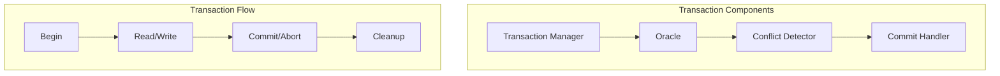
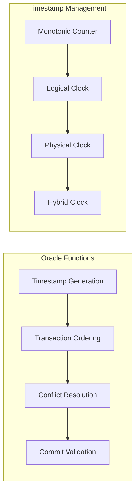
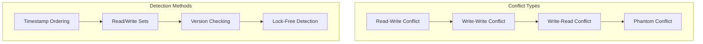
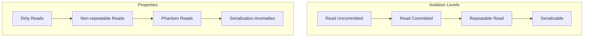
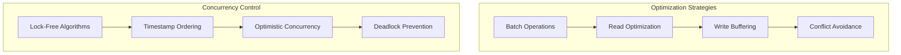

# Transaction System

Wombat provides ACID transaction support through a sophisticated transaction system based on timestamp ordering and optimistic concurrency control.

## Transaction Architecture



## ACID Properties

### Atomicity
- All operations in a transaction succeed or fail together
- Write-ahead logging ensures durability
- Rollback mechanisms for failed transactions

### Consistency
- Database constraints are maintained
- Referential integrity preserved
- Schema consistency enforced

### Isolation
- Transactions appear to execute in isolation
- Multiple isolation levels supported
- Conflict detection and resolution

### Durability
- Committed transactions survive system failures
- Write-ahead logging for persistence
- Checkpointing for recovery

## Transaction Implementation

### Transaction Structure

```zig
pub const Transaction = struct {
    id: u64,
    start_timestamp: u64,
    commit_timestamp: ?u64,
    state: TransactionState,
    read_set: std.ArrayList(ReadEntry),
    write_set: std.ArrayList(WriteEntry),
    
    pub const TransactionState = enum {
        active,
        committing,
        committed,
        aborted,
    };
    
    pub const ReadEntry = struct {
        key: []const u8,
        timestamp: u64,
        value: ?[]const u8,
    };
    
    pub const WriteEntry = struct {
        key: []const u8,
        value: ?[]const u8, // null for delete
        timestamp: u64,
    };
};
```

### Oracle System



### Oracle Implementation

```zig
pub const Oracle = struct {
    next_timestamp: std.atomic.Atomic(u64),
    active_transactions: std.HashMap(u64, *Transaction),
    mutex: std.Thread.Mutex,
    
    pub fn init() Oracle {
        return Oracle{
            .next_timestamp = std.atomic.Atomic(u64).init(1),
            .active_transactions = std.HashMap(u64, *Transaction).init(allocator),
            .mutex = std.Thread.Mutex{},
        };
    }
    
    pub fn beginTransaction(self: *Oracle) !*Transaction {
        const timestamp = self.next_timestamp.fetchAdd(1, .seq_cst);
        
        const transaction = try allocator.create(Transaction);
        transaction.* = Transaction{
            .id = timestamp,
            .start_timestamp = timestamp,
            .commit_timestamp = null,
            .state = .active,
            .read_set = std.ArrayList(ReadEntry).init(allocator),
            .write_set = std.ArrayList(WriteEntry).init(allocator),
        };
        
        self.mutex.lock();
        defer self.mutex.unlock();
        
        try self.active_transactions.put(timestamp, transaction);
        return transaction;
    }
    
    pub fn commitTransaction(self: *Oracle, transaction: *Transaction) !void {
        // Validate transaction can commit
        try self.validateCommit(transaction);
        
        // Assign commit timestamp
        transaction.commit_timestamp = self.next_timestamp.fetchAdd(1, .seq_cst);
        transaction.state = .committing;
        
        // Apply writes to database
        try self.applyWrites(transaction);
        
        // Mark as committed
        transaction.state = .committed;
        
        // Remove from active transactions
        self.mutex.lock();
        defer self.mutex.unlock();
        _ = self.active_transactions.remove(transaction.id);
    }
    
    fn validateCommit(self: *Oracle, transaction: *Transaction) !void {
        // Check for conflicts with other transactions
        for (transaction.read_set.items) |read_entry| {
            if (try self.hasConflict(transaction, read_entry.key, read_entry.timestamp)) {
                return error.TransactionConflict;
            }
        }
        
        for (transaction.write_set.items) |write_entry| {
            if (try self.hasWriteConflict(transaction, write_entry.key)) {
                return error.WriteConflict;
            }
        }
    }
};
```

## Conflict Detection

### Conflict Types



### Conflict Detector

```zig
pub const ConflictDetector = struct {
    mode: ConflictDetectionMode,
    
    pub const ConflictDetectionMode = enum {
        none,
        basic,
        advanced,
    };
    
    pub fn detectConflicts(self: *ConflictDetector, transaction: *Transaction, key: []const u8, 
                          operation: Operation) !bool {
        return switch (self.mode) {
            .none => false,
            .basic => self.detectBasicConflicts(transaction, key, operation),
            .advanced => self.detectAdvancedConflicts(transaction, key, operation),
        };
    }
    
    fn detectBasicConflicts(self: *ConflictDetector, transaction: *Transaction, key: []const u8, 
                           operation: Operation) !bool {
        // Check for concurrent writes to the same key
        const current_value = try self.db.get(key);
        defer if (current_value) |value| self.db.allocator.free(value);
        
        // Check if value was modified since transaction started
        if (current_value) |value| {
            const value_timestamp = try self.getValueTimestamp(key);
            if (value_timestamp > transaction.start_timestamp) {
                return true; // Conflict detected
            }
        }
        
        return false;
    }
    
    fn detectAdvancedConflicts(self: *ConflictDetector, transaction: *Transaction, key: []const u8, 
                              operation: Operation) !bool {
        // More sophisticated conflict detection
        // Consider range conflicts, phantom reads, etc.
        
        // Check for overlapping key ranges
        if (try self.hasRangeConflict(transaction, key)) {
            return true;
        }
        
        // Check for phantom reads
        if (operation == .read and try self.hasPhantomConflict(transaction, key)) {
            return true;
        }
        
        return self.detectBasicConflicts(transaction, key, operation);
    }
};
```

## Isolation Levels

### Supported Isolation Levels



### Isolation Level Implementation

```zig
pub const IsolationLevel = enum {
    read_uncommitted,
    read_committed,
    repeatable_read,
    serializable,
};

pub const IsolationManager = struct {
    level: IsolationLevel,
    
    pub fn canRead(self: *IsolationManager, transaction: *Transaction, key: []const u8, 
                   value_timestamp: u64) bool {
        return switch (self.level) {
            .read_uncommitted => true,
            .read_committed => self.isCommitted(value_timestamp),
            .repeatable_read => self.isCommittedBefore(value_timestamp, transaction.start_timestamp),
            .serializable => self.isSerializable(transaction, key, value_timestamp),
        };
    }
    
    fn isCommitted(self: *IsolationManager, timestamp: u64) bool {
        // Check if transaction with given timestamp is committed
        return self.oracle.isCommitted(timestamp);
    }
    
    fn isCommittedBefore(self: *IsolationManager, value_timestamp: u64, start_timestamp: u64) bool {
        return self.isCommitted(value_timestamp) and value_timestamp < start_timestamp;
    }
    
    fn isSerializable(self: *IsolationManager, transaction: *Transaction, key: []const u8, 
                     value_timestamp: u64) bool {
        // Strict serializability check
        if (!self.isCommittedBefore(value_timestamp, transaction.start_timestamp)) {
            return false;
        }
        
        // Check for serialization conflicts
        return !self.hasSerializationConflict(transaction, key, value_timestamp);
    }
};
```

## Transaction API

### Basic Transaction Operations

```zig
pub const TransactionDB = struct {
    db: *DB,
    oracle: *Oracle,
    conflict_detector: *ConflictDetector,
    
    pub fn begin(self: *TransactionDB) !*Transaction {
        return self.oracle.beginTransaction();
    }
    
    pub fn get(self: *TransactionDB, transaction: *Transaction, key: []const u8) !?[]const u8 {
        // Check write set first
        for (transaction.write_set.items) |write_entry| {
            if (std.mem.eql(u8, write_entry.key, key)) {
                return if (write_entry.value) |value| try self.db.allocator.dupe(u8, value) else null;
            }
        }
        
        // Check for conflicts
        if (try self.conflict_detector.detectConflicts(transaction, key, .read)) {
            return error.TransactionConflict;
        }
        
        // Read from database
        const value = try self.db.get(key);
        
        // Add to read set
        try transaction.read_set.append(ReadEntry{
            .key = try self.db.allocator.dupe(u8, key),
            .timestamp = std.time.milliTimestamp(),
            .value = if (value) |v| try self.db.allocator.dupe(u8, v) else null,
        });
        
        return value;
    }
    
    pub fn set(self: *TransactionDB, transaction: *Transaction, key: []const u8, value: []const u8) !void {
        // Check for conflicts
        if (try self.conflict_detector.detectConflicts(transaction, key, .write)) {
            return error.TransactionConflict;
        }
        
        // Add to write set
        try transaction.write_set.append(WriteEntry{
            .key = try self.db.allocator.dupe(u8, key),
            .value = try self.db.allocator.dupe(u8, value),
            .timestamp = std.time.milliTimestamp(),
        });
    }
    
    pub fn delete(self: *TransactionDB, transaction: *Transaction, key: []const u8) !void {
        // Check for conflicts
        if (try self.conflict_detector.detectConflicts(transaction, key, .write)) {
            return error.TransactionConflict;
        }
        
        // Add delete to write set
        try transaction.write_set.append(WriteEntry{
            .key = try self.db.allocator.dupe(u8, key),
            .value = null, // null indicates delete
            .timestamp = std.time.milliTimestamp(),
        });
    }
    
    pub fn commit(self: *TransactionDB, transaction: *Transaction) !void {
        try self.oracle.commitTransaction(transaction);
    }
    
    pub fn abort(self: *TransactionDB, transaction: *Transaction) void {
        transaction.state = .aborted;
        
        // Clean up transaction resources
        self.cleanup(transaction);
    }
};
```

## Performance Optimization

### Transaction Optimization



### Performance Metrics

```zig
pub const TransactionMetrics = struct {
    transactions_started: u64,
    transactions_committed: u64,
    transactions_aborted: u64,
    conflicts_detected: u64,
    average_duration: f64,
    
    pub fn recordTransaction(self: *TransactionMetrics, transaction: *Transaction, success: bool) void {
        self.transactions_started += 1;
        
        if (success) {
            self.transactions_committed += 1;
        } else {
            self.transactions_aborted += 1;
        }
        
        const duration = if (transaction.commit_timestamp) |commit_ts| 
            commit_ts - transaction.start_timestamp else 0;
        
        self.average_duration = (self.average_duration * @as(f64, @floatFromInt(self.transactions_started - 1)) + 
                                @as(f64, @floatFromInt(duration))) / @as(f64, @floatFromInt(self.transactions_started));
    }
    
    pub fn getAbortRate(self: TransactionMetrics) f64 {
        if (self.transactions_started == 0) return 0.0;
        return @as(f64, @floatFromInt(self.transactions_aborted)) / @as(f64, @floatFromInt(self.transactions_started));
    }
};
```

This comprehensive transaction system provides ACID guarantees while maintaining high performance through optimistic concurrency control and efficient conflict detection.